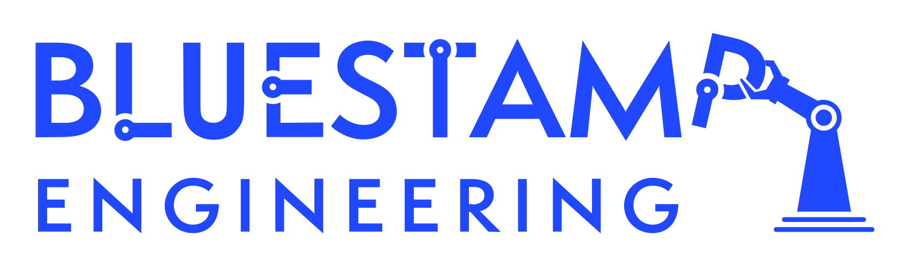

# Bluestamp Engineering Drawing Robot

This is a drawing robot that uses a gyroscope to steer itself as it moves, so it can trace shapes and drawings onto paper. It runs on an Arduino Nano ESP32 and brings together a few different systems: motors with encoders, a gyro to track direction, a servo to lift the pen, and a bluetooth website to send it commands. 

<!--- This is an HTML comment in Markdown -->
<!--- Anything between these symbols will not render on the published site -->

| **Engineer** | **School** | **Area of Interest** | **Grade** |
|:--:|:--:|:--:|:--:|
| Chase L | Mtn View | Electrical Engineering | Incoming Junior |

<!--- Replace the logo below with a photo of yourself and your project once it's further along. Guide: https://tomcam.github.io/least-github-pages/adding-images-github-pages-site.html -->



<!--- Second Milestone and Final Milestone are commented out until they're done. The section headers and videos are kept so the structure stays in place. -->

<!---
# Final Milestone

<iframe width="560" height="315" src="https://www.youtube.com/embed/F7M7imOVGug" title="YouTube video player" frameborder="0" allow="accelerometer; autoplay; clipboard-write; encrypted-media; gyroscope; picture-in-picture; web-share" allowfullscreen></iframe>

For your final milestone, explain the outcome of your project. Key details to include are:
- What you've accomplished since your previous milestone
- What your biggest challenges and triumphs were at BSE
- A summary of key topics you learned about
- What you hope to learn in the future after everything you've learned at BSE
-->

<!---
# Second Milestone

<iframe width="560" height="315" src="https://www.youtube.com/embed/y3VAmNlER5Y" title="YouTube video player" frameborder="0" allow="accelerometer; autoplay; clipboard-write; encrypted-media; gyroscope; picture-in-picture; web-share" allowfullscreen></iframe>

For your second milestone, explain what you've worked on since your previous milestone. You can highlight:
- Technical details of what you've accomplished and how they contribute to the final goal
- What has been surprising about the project so far
- Previous challenges you faced that you overcame
- What needs to be completed before your final milestone
-->

# First Milestone

<iframe width="560" height="315" src="https://www.youtube.com/embed/nFOEWR1XK8A?si=o8Ssw78IqVJhE14k" title="YouTube video player" frameborder="0" allow="accelerometer; autoplay; clipboard-write; encrypted-media; gyroscope; picture-in-picture; web-share" referrerpolicy="strict-origin-when-cross-origin" allowfullscreen></iframe>

My first milestone was planning out the full build and getting all the electronics figured out before putting the robot together.

The robot has a few main parts that all have to work with each other. The Arduino Nano is the brain that controls everything. Two N20 motors with encoders drive the wheels and keep track of how far the robot has moved. A BNO055 gyro measures which way the robot is facing so it can turn accurately. An SG90 servo raises and lowers the pencil/drawing utensil, a L9110 motor driver sits between the Arduino and the motors and controls their speed and direction.

The biggest challenge at this stage was getting started. Initially, the wiring diagrams looked way too complicated to understand, so it took a few days to really start to get it, and I didn't start wiring with the breadboard until about a week in. However, it wasn't just the wires. I also had to figure out what all the parts I mentioned above actually did. We were also initially going to use an Arduino UNO, TB6612FNG motor driver, and an HC-05 for bluetooth, but we switched all of those things out for the nano & L9110 driver, so I had to get a deeper understanding of how to wire them. Eventually, I did get it and now I have a fully functioning circuit.

For my next milestones I plan to attach everything to the base, get the motors and gyro working together so the robot can drive straight and turn to a set direction, and then add the pen-lift on so it can actually draw.

# Schematics

<!--- Add your schematic image here once it's made. Tinkercad (https://www.tinkercad.com/blog/official-guide-to-tinkercad-circuits) and Fritzing (https://fritzing.org/learning/) are both good options. BSE recommends Tinkercad since it runs free in the browser. -->

# Code

<!--- Paste your Milestone 1 code here once it's ready. The block below is just a placeholder from the template. Formatting guide: https://www.markdownguide.org/extended-syntax/ -->

```c++
void setup() {
  // put your setup code here, to run once:
  Serial.begin(9600);
  Serial.println("Hello World!");
}

void loop() {
  // put your main code here, to run repeatedly:

}
```

# Bill of Materials

<!--- Prices below are typical hobbyist estimates and will vary by seller. Replace each price and the Link with the actual item and price you purchased. -->

| **Part** | **Note** | **Price** | **Link** |
|:--:|:--:|:--:|:--:|
| Arduino NANO ESP32 | Main microcontroller that runs the plotter and the g-code interpreter | $20 | <a href="https://store-usa.arduino.cc/products/nano-esp32-with-headers?utm_source=google&utm_medium=cpc&utm_campaign=US-Pmax&gad_source=1&gad_campaignid=21317508903&gbraid=0AAAAACbEa85s_ViD5yIHHsZGsDyVVrjz4&gclid=CjwKCAjwpK3SBhASEiwAtV1SPNicdazsvQfAH9B3H2CtwpTZcjwmq57zrKEi2BHB2wUEBoWZIpqFXhoCz2MQAvD_BwE"> Link </a> |
| BNO055 Sensor Fusion Module | 9-axis IMU/gyro used for accurate heading and turns | $20 | <a href="https://www.amazon.com/GY-BNO055-Absolute-Orientation-Breakout-Gyroscope/dp/B0CKS1W63K"> Link </a> |
| N20 6V 60 RPM DC Motor with Encoder (x2) | Drive motors for the two wheels; encoders track distance | $18 | <a href="https://www.amazon.com/Gearmotor-Robotics-Encoder-Replacement-150-3000RPM/dp/B0GDV14XL5"> Link </a> |
| L9110 Motor Driver | Controls speed/direction of the two N20 motors | $2 | <a href="https://www.aliexpress.us/item/3256808109455456.html?src=google&snps=y&src=google&albch=shopping&acnt=708-803-3821&isdl=y&slnk=&plac=&mtctp=&albbt=Google_7_shopping&aff_platform=google&aff_short_key=UneMJZVf&gclsrc=aw.ds&albagn=888888&ds_e_adid=&ds_e_matchtype=&ds_e_device=c&ds_e_network=x&ds_e_product_group_id=&ds_e_product_id=en3256808109455456&ds_e_product_merchant_id=5446116119&ds_e_product_country=US&ds_e_product_language=en&ds_e_product_channel=online&ds_e_product_store_id=&ds_url_v=2&albcp=20542171667&albag=&isSmbAutoCall=false&needSmbHouyi=false&gad_source=1&gad_campaignid=18545443176&gbraid=0AAAAAD6I-hFqyMngN-HgL9GtY3F8WiNtV&gclid=CjwKCAjwpK3SBhASEiwAtV1SPHCXWt39-iCecfV2K0ml8IJ9ynNHOuoJVXt9ARZU8BudB5oY3XCx1xoCa5AQAvD_BwE&gatewayAdapt=glo2usa"> Link </a> |
| SG90 Micro Servo | Pen-lift mechanism (raises and lowers the pen) | $2 | <a href="https://www.amazon.com/s?k=SG90+micro+servo"> Link </a> |
| 7806 6V Voltage Regulator | Regulated 6V rail for the motors and servo | $8 | <a href="https://www.amazon.com/Parts-Express-7806-Voltage-Regulator/dp/B0002ZPXJG"> Link </a> |
| 9V Battery | Powers the Arduino and the 6V regulator | $2 | <a href="https://www.amazon.com/s?k=9V+battery"> Link </a> |
| 1N4007 Diode (x2)| Reverse-polarity protection on the power input | $1 | <a href="https://www.amazon.com/s?k=1N4007+diode"> Link </a> |
| Toggle Switch | Main on/off power switch | $3 | <a href="https://www.amazon.com/s?k=SPDT+toggle+switch"> Link </a> |
| Screw Terminal Block | Connection point for the 9V power input wires | $1 | <a href="https://www.amazon.com/s?k=2+pin+screw+terminal+block+5mm"> Link </a> |
| Jumper / Hookup Wire | Wiring between all components | $7 | <a href="https://www.amazon.com/s?k=dupont+jumper+wire+kit"> Link </a> |
| Acrylic Sheet (base) | Flat platform that all components bolt onto | $8 | <a href="https://www.amazon.com/s?k=acrylic+sheet"> Link </a> |
| Wheels (x2) | Driven by the N20 motors to move the plotter | $5 | <a href="https://www.amazon.com/s?k=N20+motor+wheels"> Link </a> |
| Misc. Hardware (screws, bolts, nuts) | Mounts servo bracket, motors, and other parts | $5 | <a href="https://www.amazon.com/s?k=M2+M3+screw+standoff+assortment+kit"> Link </a> |
| 3D Printed Parts (pen-lift assembly, battery holder, 2 glides) | Printed from the included STL files; cost is filament only | $2 | <a href="https://www.instructables.com/Gyro-Controlled-Robot-Plotter/"> STL files </a> |
| Pencil / Fibre-tip Pen | The drawing instrument held by the pen-lift tube | $1 | <a href="https://www.amazon.com/s?k=pencil"> Link </a> |

Estimated total: ~$93 at the prices above. The original project lists an estimated cost of under $100 excluding shipping, so the total will depend on which clone/branded parts you buy.

# Starter Project

<iframe width="560" height="315" src="https://www.youtube.com/embed/lCnJr1lV2uc?si=LOnjVyLKFEXgHM3o" title="YouTube video player" frameborder="0" allow="accelerometer; autoplay; clipboard-write; encrypted-media; gyroscope; picture-in-picture; web-share" referrerpolicy="strict-origin-when-cross-origin" allowfullscreen></iframe>

My Starter Project was the LED Slider that was pretty much just soldering practice. The end goal was intended to be three different sliders that increase/decrease resistance for red, green, and blue parts of an LED, changing the color.

However, when I soldered everything on, it wouldn't work. I de-soldered and re-soldered pretty much every connection but it would never work. I even tried flipping the orientation of the light bulb, yet it still wouldn't turn on. In the end, I had to unfortunately give up to begin working on my intensive project, the Drawing Robot. However, my soldering skills greatly improved throughout the process because although there were initially less than 30 connections, I ended up working on around 100 different solders. I also used these skills in the main project, so it was a very good introduction, even if I didn't get the end product.

# Other Resources & Examples
Obviously, this is not the only drawing robot that exists. I took inspiration for this project from lingib's gyro-controlled drawing robot. This is what I used for the circuit diagrams, 3d printed parts, and many of the materials, although I did make a good amount of changes to key materials/pieces and the circuits as well:
- [lingib's Gyro Controlled Robot Plotter](https://www.instructables.com/Gyro-Controlled-Robot-Plotter/#discuss)

Other examples of drawing robots can be found below:
- [Hackaday Drawing Robot](https://sviatil0.github.io/Sviatoslav_BSE/)
- [Ken Olsen's Arduino Robot](https://www.instructables.com/Arduino-Drawing-Robot/)
- 
