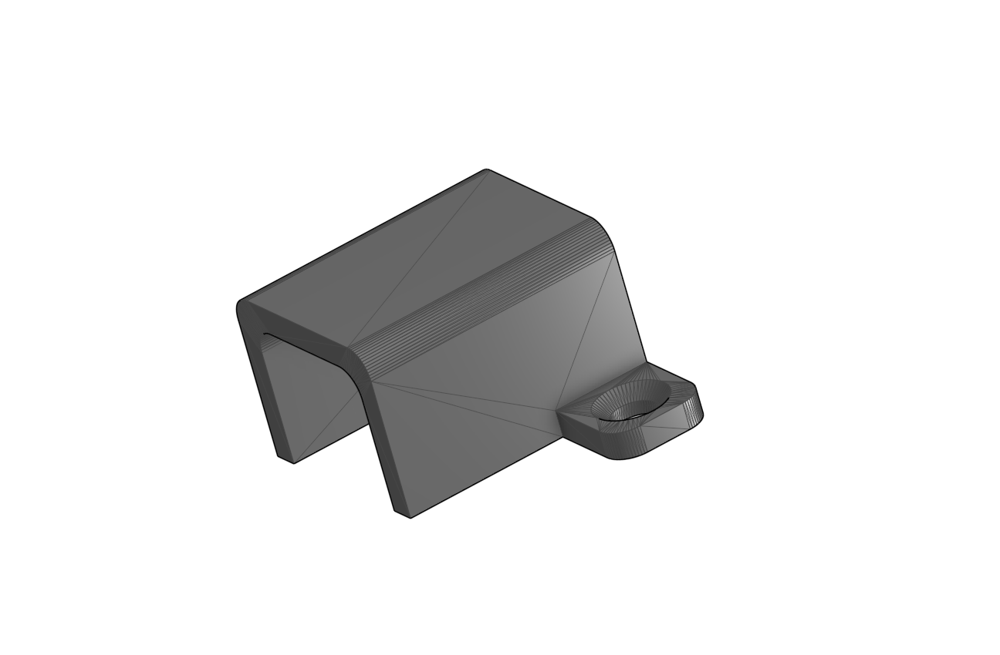
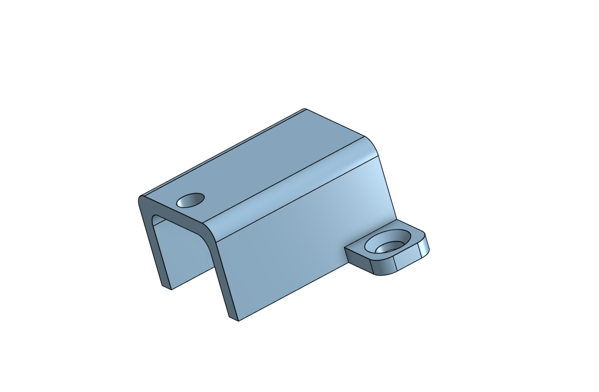
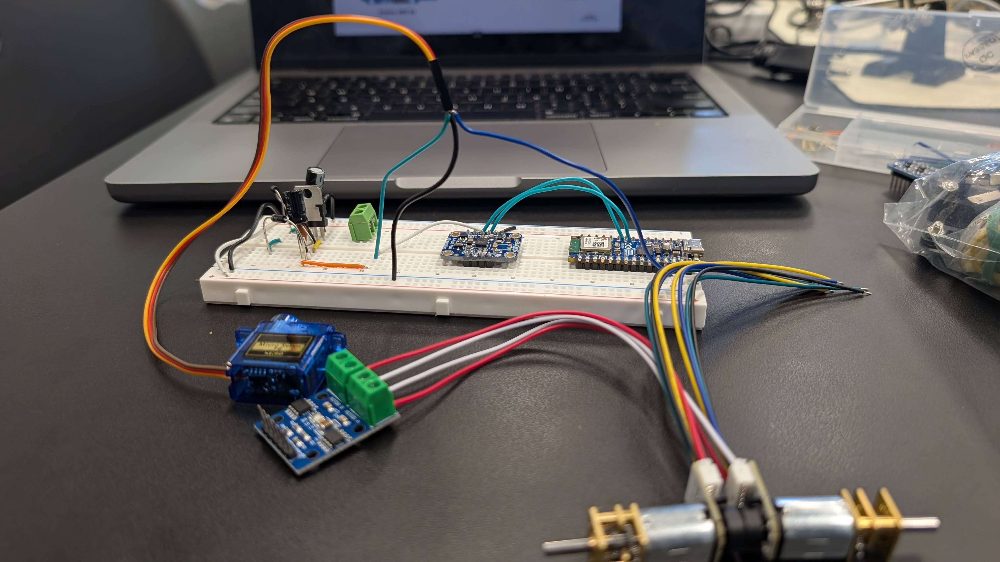
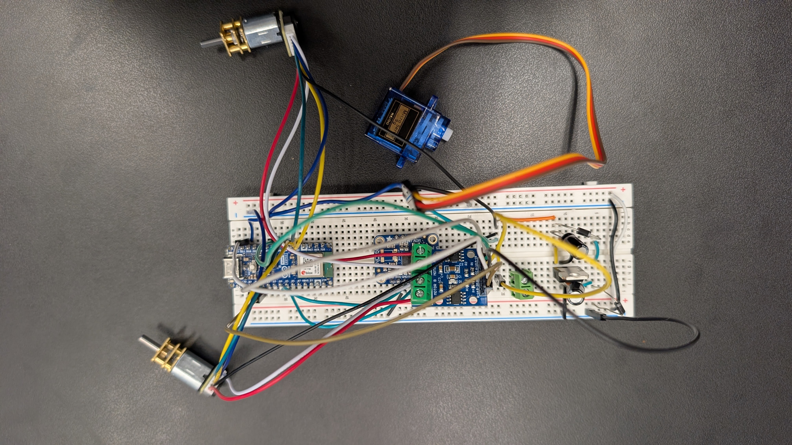

# Bluestamp Engineering Drawing Robot

This is a drawing robot that uses a gyroscope to steer itself as it moves, so it can trace shapes and drawings onto paper. It runs on an Arduino Nano ESP32 and brings together a few different systems: motors with encoders, a gyro to track direction, a servo to lift the pen, and a bluetooth website to send it commands. 

<!--- This is an HTML comment in Markdown -->
<!--- Anything between these symbols will not render on the published site -->

| **Engineer** | **School** | **Area of Interest** | **Grade** |
|:--:|:--:|:--:|:--:|
| Chase L | Mtn View | Electrical Engineering | Incoming Junior |

<!--- Replace the logo below with a photo of yourself and your project once it's further along. Guide: https://tomcam.github.io/least-github-pages/adding-images-github-pages-site.html -->


<!--- Second Milestone and Final Milestone are commented out until they're done. The section headers and videos are kept so the structure stays in place. -->

<!---
# Final Milestone

<iframe width="560" height="315" src="https://www.youtube.com/embed/F7M7imOVGug" title="YouTube video player" frameborder="0" allow="accelerometer; autoplay; clipboard-write; encrypted-media; gyroscope; picture-in-picture; web-share" allowfullscreen></iframe>

For your final milestone, explain the outcome of your project. Key details to include are:
- What you've accomplished since your previous milestone
- What your biggest challenges and triumphs were at BSE
- A summary of key topics you learned about
- What you hope to learn in the future after everything you've learned at BSE
-->

# Final Milestone

My final milestone was the finished drawing robot. It is able to interpret g-code and draw based on it's instructions. This changes for this milestone were done mostly on the software side, with a few tweaks made to the robot itself. The most notable of these tweaks were finding a perfectly-sized screw to mount into the motor holders and to stop the motor from shifting around, and switching out the normal HB Ticonderoga pencil for a specialized 8B pencil, making it show up as a much bolder line that reduces friction. The rest was pretty much software and a ton of calibration, adjusting variables such as COUNTS_PER_MM to track distance and Backlash for adjusting the degrees for each individual motor accounting for power difference and resistance and for the fact that the robot is not perfectly aligned.

Besides calibration, the robot also needed to be able to draw drawings that anyone can find online. To do this, I am using the app inkscape to trace the outline of an image that I upload, which can then be downloaded as an .svg (scalable vector graphic). 

Here is a screen recording of the entire process on how to get the svg file from inkscape and trace the outline:
<iframe width="560" height="315" src="https://www.youtube.com/embed/WxKX8i-fKks?si=jRNI7UNEH1nHygfW" title="YouTube video player" frameborder="0" allow="accelerometer; autoplay; clipboard-write; encrypted-media; gyroscope; picture-in-picture; web-share" referrerpolicy="strict-origin-when-cross-origin" allowfullscreen></iframe>

For reference, the Inkscape App can be found at this link: [https://inkscape.org/release/inkscape-1.4.4/](inkscape.org)
This can then be converted into g-code for my robot to interpret using this python script:
```python
"""
svg_to_gcode.py - convert an Inkscape SVG outline into the gyro_robot_plotter
firmware's g-code dialect.

  python3 svg_to_gcode.py cat.svg                     # prints g-code, writes cat.preview.svg
  python3 svg_to_gcode.py cat.svg --size 120          # fit within 120 mm (default 80)
  python3 svg_to_gcode.py cat.svg --min-turn 20       # merge corners shallower than 20 deg
  python3 svg_to_gcode.py cat.svg --close-x -2 --close-y -15   # compass-rule closure fix

Emits ONLY what the firmware understands:
  G0 X.. Y..   travel with pen UP   (firmware lifts the pen on G00)
  G1 X.. Y..   draw with pen DOWN   (firmware drops the pen on G01)
No Z, no M3/M5 - the pen is controlled purely by move type.
Curves are flattened to short straight segments (the firmware handles those fine).
"""
import math, re, sys

# ---- tiny self-contained SVG path parser (M L H V C S Q T Z, abs+rel) --------
def tokenize_path(d):
    return re.findall(r'[MmLlHhVvCcSsQqTtAaZz]|-?\d*\.?\d+(?:[eE][-+]?\d+)?', d)

def cubic(p0, p1, p2, p3, n=10):
    pts = []
    for i in range(1, n + 1):
        t = i / n; mt = 1 - t
        x = mt*mt*mt*p0[0] + 3*mt*mt*t*p1[0] + 3*mt*t*t*p2[0] + t*t*t*p3[0]
        y = mt*mt*mt*p0[1] + 3*mt*mt*t*p1[1] + 3*mt*t*t*p2[1] + t*t*t*p3[1]
        pts.append((x, y))
    return pts

def quad(p0, p1, p2, n=10):
    pts = []
    for i in range(1, n + 1):
        t = i / n; mt = 1 - t
        x = mt*mt*p0[0] + 2*mt*t*p1[0] + t*t*p2[0]
        y = mt*mt*p0[1] + 2*mt*t*p1[1] + t*t*p2[1]
        pts.append((x, y))
    return pts

def parse_path(d):
    """Return a list of subpaths; each subpath is a list of (x,y) points."""
    toks = tokenize_path(d)
    i = 0
    subpaths, cur = [], []
    x = y = 0.0
    start = (0.0, 0.0)
    prev_ctrl = None
    cmd = None
    def num():
        nonlocal i
        v = float(toks[i]); i += 1
        return v
    while i < len(toks):
        t = toks[i]
        if re.match(r'[A-Za-z]', t):
            cmd = t; i += 1
        rel = cmd.islower()
        C = cmd.upper()
        if C == 'M':
            nx, ny = num(), num()
            if rel: nx += x; ny += y
            if cur: subpaths.append(cur)
            cur = [(nx, ny)]
            x, y = nx, ny; start = (x, y); prev_ctrl = None
            cmd = 'l' if rel else 'L'
        elif C == 'L':
            nx, ny = num(), num()
            if rel: nx += x; ny += y
            cur.append((nx, ny)); x, y = nx, ny; prev_ctrl = None
        elif C == 'H':
            nx = num()
            if rel: nx += x
            cur.append((nx, y)); x = nx; prev_ctrl = None
        elif C == 'V':
            ny = num()
            if rel: ny += y
            cur.append((x, ny)); y = ny; prev_ctrl = None
        elif C == 'C':
            x1, y1, x2, y2, nx, ny = (num() for _ in range(6))
            if rel: x1+=x; y1+=y; x2+=x; y2+=y; nx+=x; ny+=y
            cur += cubic((x,y),(x1,y1),(x2,y2),(nx,ny))
            prev_ctrl = (x2, y2); x, y = nx, ny
        elif C == 'S':
            x2, y2, nx, ny = (num() for _ in range(4))
            if rel: x2+=x; y2+=y; nx+=x; ny+=y
            x1, y1 = (2*x - prev_ctrl[0], 2*y - prev_ctrl[1]) if prev_ctrl else (x, y)
            cur += cubic((x,y),(x1,y1),(x2,y2),(nx,ny))
            prev_ctrl = (x2, y2); x, y = nx, ny
        elif C == 'Q':
            x1, y1, nx, ny = (num() for _ in range(4))
            if rel: x1+=x; y1+=y; nx+=x; ny+=y
            cur += quad((x,y),(x1,y1),(nx,ny))
            prev_ctrl = (x1, y1); x, y = nx, ny
        elif C == 'T':
            nx, ny = num(), num()
            if rel: nx+=x; ny+=y
            x1, y1 = (2*x - prev_ctrl[0], 2*y - prev_ctrl[1]) if prev_ctrl else (x, y)
            cur += quad((x,y),(x1,y1),(nx,ny))
            prev_ctrl = (x1, y1); x, y = nx, ny
        elif C == 'A':
            _rx,_ry,_rot,_laf,_sf,nx,ny = (num() for _ in range(7))
            if rel: nx+=x; ny+=y
            cur.append((nx, ny)); x, y = nx, ny; prev_ctrl = None
        elif C == 'Z':
            if cur:
                cur.append(start)
                subpaths.append(cur); cur = []
            x, y = start; prev_ctrl = None
        else:
            i += 1
    if cur: subpaths.append(cur)
    return subpaths

def get_paths(svg_text):
    return re.findall(r'<path[^>]*\bd="([^"]+)"', svg_text)

def _turn_at(P, i):
    b1 = math.degrees(math.atan2(P[i][0]-P[i-1][0], P[i][1]-P[i-1][1]))
    b2 = math.degrees(math.atan2(P[i+1][0]-P[i][0], P[i+1][1]-P[i][1]))
    return abs((b2 - b1 + 180) % 360 - 180)

def merge_shallow(P, thresh):
    """Greedily drop the vertex with the shallowest corner until every remaining
    corner turns at least `thresh` degrees - leaves only corners the robot pivots
    cleanly, straightening shallow bends the pivot can't hit."""
    P = P[:]
    while len(P) > 6:
        worst_i, worst = None, 999.0
        for i in range(1, len(P)-1):
            t = _turn_at(P, i)
            if t < worst: worst, worst_i = t, i
        if worst >= thresh: break
        P.pop(worst_i)
    return P

def close_gap(P, gx, gy):
    """Compass-rule closure: the robot ends a repeatable (gx,gy) mm from where it
    started, so pre-shift each point by that error scaled by how far along the path
    it sits - start unmoved, end moved the full -gap. When the robot re-adds its
    consistent error, the drawn end lands back on the start."""
    n = len(P)
    d = [0.0]*n
    for i in range(1, n):
        d[i] = d[i-1] + math.hypot(P[i][0]-P[i-1][0], P[i][1]-P[i-1][1])
    total = d[-1] or 1.0
    return [(P[i][0] - gx*d[i]/total, P[i][1] - gy*d[i]/total) for i in range(n)]

def main():
    if len(sys.argv) < 2:
        print(__doc__); sys.exit(1)
    infile = sys.argv[1]
    target_mm = 80.0
    if '--size' in sys.argv:
        target_mm = float(sys.argv[sys.argv.index('--size') + 1])
    min_turn = 20.0
    if '--min-turn' in sys.argv:
        min_turn = float(sys.argv[sys.argv.index('--min-turn') + 1])
    close_x = close_y = 0.0
    if '--close-x' in sys.argv: close_x = float(sys.argv[sys.argv.index('--close-x')+1])
    if '--close-y' in sys.argv: close_y = float(sys.argv[sys.argv.index('--close-y')+1])
    scale_x = scale_y = 1.0
    if '--scale-x' in sys.argv: scale_x = float(sys.argv[sys.argv.index('--scale-x')+1])
    if '--scale-y' in sys.argv: scale_y = float(sys.argv[sys.argv.index('--scale-y')+1])
    keep = None   # keep only the Nth <path> element (0-based); None = all
    if '--keep' in sys.argv: keep = int(sys.argv[sys.argv.index('--keep')+1])
    min_seg = 1.5

    svg = open(infile).read()
    paths = get_paths(svg)
    if keep is not None:
        paths = [paths[keep]]
    subs = []
    for d in paths:
        subs += parse_path(d)
    if not subs:
        print("No <path> data found.", file=sys.stderr); sys.exit(1)

    pts = [p for s in subs for p in s]
    xs = [p[0] for p in pts]; ys = [p[1] for p in pts]
    minx, maxx, miny, maxy = min(xs), max(xs), min(ys), max(ys)
    w, h = maxx - minx, maxy - miny
    scale = target_mm / max(w, h)

    def tx(p):   # to mm, recentre, flip Y (SVG y-down -> plotter y-up), per-axis scale
        return ((p[0] - minx) * scale * scale_x, (maxy - p[1]) * scale * scale_y)

    out = [[tx(p) for p in s] for s in subs]
    def plen(s):
        return sum(math.hypot(s[i+1][0]-s[i][0], s[i+1][1]-s[i][1]) for i in range(len(s)-1))
    out = [s for s in out if plen(s) >= min_seg]
    if min_turn > 0:
        out = [merge_shallow(s, min_turn) for s in out]
    if close_x or close_y:
        main_i = max(range(len(out)), key=lambda i: len(out[i]))
        out[main_i] = close_gap(out[main_i], close_x, close_y)

    g = []
    for s in out:
        g.append(f"G0 X{s[0][0]:.3f} Y{s[0][1]:.3f}")
        for p in s[1:]:
            g.append(f"G1 X{p[0]:.3f} Y{p[1]:.3f}")
    g.append("G0 X0 Y0")
    print("\n".join(g))

    try:
        allp = [p for s in out for p in s]
        bx = [p[0] for p in allp]; by = [p[1] for p in allp]
        mnx, mxx, mny, mxy = min(bx), max(bx), min(by), max(by)
        pad = 6; W = mxx-mnx+2*pad; H = mxy-mny+2*pad
        svg_out = [f'<svg xmlns="http://www.w3.org/2000/svg" width="{W*4}" height="{H*4}" '
                   f'viewBox="0 0 {W} {H}"><rect width="{W}" height="{H}" fill="white"/>']
        for s in out:
            pl = " ".join(f"{p[0]-mnx+pad:.2f},{mxy-p[1]+pad:.2f}" for p in s)
            svg_out.append(f'<polyline points="{pl}" fill="none" stroke="black" stroke-width="0.4"/>')
        svg_out.append("</svg>")
        base = infile.rsplit('.', 1)[0]
        open(base + '.preview.svg', 'w').write("\n".join(svg_out))
        n = sum(len(s) for s in out)
        print(f"\n[{len(out)} strokes, {n} points, {mxx-mnx:.0f}x{mxy-mny:.0f} mm; "
              f"preview -> {base}.preview.svg]", file=sys.stderr)
    except Exception as e:
        print(f"[preview skipped: {e}]", file=sys.stderr)

if __name__ == '__main__':
    main()
```

Finally, the outputted g-code can be pasted directly into the website for the robot to read.
If you want to view the G-code Yourself, you can use this website, [https://ncviewer.com/](ncviewer.com), paste it into the field on the left, and click plot.
This is what the website looks like:


This is the full code of the finished robot:

```cpp
/*************************************************************************
  robot plotter V7 - ESP32 web-controlled, structured after lingib's sketch
  lingib https://www.instructables.com/Gyro-Controlled-Robot-Plotter/
  differences: ESP32 + L9110 + Wi-Fi dashboard, gyro straightness, g-code interpretor
**************************************************************************/

#include <WiFi.h>
#include <WebServer.h>
#include <Wire.h>
#include <Adafruit_Sensor.h>
#include <Adafruit_BNO055.h>
#include <Servo.h>

// --- Wi-Fi ---
/*x
const char* ssid     = "Bluestamps-J9";
const char* password = "j9bestroom";
*/

const char* ssid     = //INSERT WIFI ID HERE;
const char* password = //INSERT WIFI PASSWORD HERE";


WebServer server(80);

// --- BNO055 fusion sensor ---
Adafruit_BNO055 bno = Adafruit_BNO055(55);
float yaw;   //raw heading straight off the sensor

// --- Pen lift ---
Servo penServo;
const int servoPin   = 10;      //D10
const int SERVO_UP   = 25+90;   //pen up - straight-up
const int SERVO_DOWN = 25;      //pen down - sideways
bool servoDown = false;         //tracks pen position

// --- L9110 motor controller (2 pins per motor, speed+dir coupled) ---
const int A1A = 6;
const int A1B = A0;
const int B1A = A1;
const int B1B = 11;

// --- Wheel encoders ---
const int enca[] = { 2, 3 };    //interrupt channel, one per motor
const int encb[] = { 4, 5 };    //second quadrature channel
volatile long encoderCount[2];  //signed counts, one per motor

// --- Initial wheel speeds ---
int baseSpeed = 140;            //driving speed (master)
const int MOTOR_TRIM = 20;      //+ boosts motor A to match B

// --- Heading control (gyro keeps lines straight) ---
float targetHeading = 0.0;
float startHeading  = 0.0;      //raw heading treated as zero (Zero Heading button)
const float Kp = 3.5;
const float Ki = 0.05;          //kills the residual drift
float headingIntegral = 0.0;    //running error sum - reset each drive
const float I_WINDUP = 1000.0;  //clamp so the sum can't run away

// --- Controlled stop ramp ---
int rampSpeed = 0;              //working speed while slowing
const int STOP_STEP = 8;        //how fast the ramp bleeds off
const int STOP_FLOOR = 40;      //brake once below this
int motorState = 0;             //0=stop 1=fwd 2=left 3=right 4=back 5,6=ramp

// --- Distance ---
const float COUNTS_PER_MM = 3.48;   //encoder counts per mm

// --- Turns ---
const float EPSILON_DEG  = 4.0;   //stop the turn within this many degrees
const int   PWM_TURN_MIN = 60;    //slowest PWM that still rotates
const int   PWM_TURN_MAX = 120;   //starting turn speed
const float PWM_DECAY    = 0.65;  //shrink turn speed after each overshoot
const unsigned long TURN_TIMEOUT_MS = 4000;   //never let a turn run longer
//Turns at or above this PIVOT; smaller course changes get steered while rolling.
//Steering needs travel distance to work (~30 mm to bend 20 deg), so on the short
//segments of a traced drawing it barely turns and flattens the corners. Pivoting
//is reliable down to the ~16 deg coast floor, so keep this just above that and let
//the g-code converter merge away any corner shallower than it - then every corner
//pivots (the primitive the calibration squares prove) and nothing is steered.
const float PIVOT_MIN_DEG = 18.0;

// --- Backlash compensation when turning ---
//A turn quits EPSILON_DEG short of where it aimed and then coasts past it, so it
//has to aim short by the difference. That difference does NOT scale with turn
//size: the taper bottoms out at the same PWM (~72) as the error closes on
//EPSILON_DEG, so a 90 corner and a 25 one let go at the same speed and coast the
//same ~16 deg (only ~6 counter-clockwise - this drivetrain is lopsided, which is
//why the two values differ so much). Hence a flat offset.
//The catch is a flat offset can't be applied to a turn smaller than itself - that
//would aim backwards - which is the dead zone moveTowards() steers around rather
//than pivots through. Tune these on the 5-square sweep.
float BACKLASH_CW  = -12.3;  //degrees added to a clockwise turn
float BACKLASH_CCW = 2.2;    //degrees added to a counter-clockwise turn

// --- Square test-plot geometry ---
const float SQUARE_MM  = 40.0;   //side length of a calibration square
const float GAP_MM     = 10.0;   //offset between squares
const float SWEEP_STEP = 1.0;    //degrees between the five sweep squares

// --- G-code parameters ---
float X = 0.0;                  //XY drawing coordinates
float Y = 0.0;
float I = 0.0;                  //I,J circle offsets
float J = 0.0;
float scaleFactor = 1.0;        //scales g-code dimensions
bool continuousMotion = false;  //suppresses stop() during arc segments
String gcodeBuffer = "";        //holds custom g-code from web dashboard

// --- Housekeeping for cartesian tracking ---
//Two different positions, and the difference matters:
//  currentX/Y - where the G-CODE thinks the pen is. Ideal, exact, never measured.
//               Arc geometry is worked out in these coordinates.
//  actualX/Y  - where the robot ACTUALLY is, integrated from the encoders and the
//               gyro as it drives. Steering onto a bearing curves the path, so a
//               move lands a little short of the point it aimed at, and those
//               shortfalls used to compound silently over a long path (the whole
//               drawing would drift out from under the g-code). Aiming every move
//               from the measured position instead stops that from accumulating.
float currentX = 0.0;           //current X coordinate in mm (ideal)
float currentY = 0.0;           //current Y coordinate in mm (ideal)
float actualX  = 0.0;           //odometry - measured X in mm
float actualY  = 0.0;           //odometry - measured Y in mm
const float maxAngleStep = PI / 9.0; //step angle for drawing smooth arcs

// --- Routine scheduler (0 = idle) ---
volatile int routine = 0;

// --- Forward declarations for the encoder ISRs ---
void IRAM_ATTR encoder0ISR();
void IRAM_ATTR encoder1ISR();

//===========
//  setup()
//===========
void setup() {
  Serial.begin(115200);

  setupServo();   //home the pen
  setupMotors();  //motor pins + encoder interrupts

  // --- BNO055 fusion sensor ---
  if (!bno.begin()) {
    Serial.println("No BNO055 detected! Check I2C wiring.");
    while (1) { delay(10); }   //halt, but keep the watchdog fed
  }
  delay(500);
  bno.setExtCrystalUse(true);

  // --- Wi-Fi ---
  WiFi.begin(ssid, password);
  while (WiFi.status() != WL_CONNECTED) {
    delay(500);
    Serial.print(".");
  }
  Serial.println("\n Wi-Fi Connected!");
  Serial.print("Robot IP Address: http://");
  Serial.println(WiFi.localIP());

  // --- Web routes (this is our command interpreter) ---
  server.on("/", handleRoot);
  server.on("/forward", handleForward);
  server.on("/backward", handleBackward);
  server.on("/left", handleLeft);
  server.on("/right", handleRight);
  server.on("/stop", handleStop);
  server.on("/telemetry", handleTelemetry);
  server.on("/reset", handleReset);
  server.on("/faster", handleFaster);
  server.on("/slower", handleSlower);
  server.on("/servo", handleServo);
  server.on("/zero_heading", handleZeroHeading);
  server.on("/cal_cw", handleCalCW);
  server.on("/cal_ccw", handleCalCCW);
  server.on("/cal_five_cw", handleCalFiveCW);
  server.on("/cal_five_ccw", handleCalFiveCCW);
  server.on("/test_turn", handleTestTurn);
  server.on("/test_turn_ccw", handleTestTurnCCW);
  server.on("/run_gcode", handleRunGCode);
  server.on("/reset_origin", handleResetOrigin);
  server.on("/custom_gcode", HTTP_POST, handleCustomGCode);

  server.begin();
}

//===========
//  loop()
//===========
void loop() {
  server.handleClient();

  // --- run any queued blocking routine here, not in a web handler ---
  if (routine == 1) { motorState = 0; drawSquareCW();  routine = 0; stop(); return; }
  if (routine == 4) { motorState = 0; drawSquareCCW(); routine = 0; stop(); return; }
  if (routine == 5) { motorState = 0; CAL_CW();        routine = 0; stop(); return; }
  if (routine == 6) { motorState = 0; CAL_CCW();       routine = 0; stop(); return; }
  if (routine == 2) { motorState = 0; turn(90);        routine = 0; stop(); return; }
  if (routine == 3) { motorState = 0; turn(-90);       routine = 0; stop(); return; }
  if (routine == 7) { motorState = 0; runTestGCode();  routine = 0; stop(); return; }
  if (routine == 8) { motorState = 0; runCustomGCode(); routine = 0; stop(); return; }

  // --- otherwise run the manual drive/turn state machine ---
  if (motorState == 1) {          //DRIVE STRAIGHT (gyro loop)
    float error = headingError(targetHeading);
    headingIntegral += error;     //accumulate leftover error, clamped
    headingIntegral = constrain(headingIntegral, -I_WINDUP, I_WINDUP);
    int correction = error * Kp + headingIntegral * Ki;
    setMotorA(baseSpeed - correction + MOTOR_TRIM, true);
    setMotorB(baseSpeed + correction, true);
  }
  else if (motorState == 2) {     //TURN LEFT (jog)
    setMotorA(baseSpeed, true);
    setMotorB(baseSpeed, false);
  }
  else if (motorState == 3) {     //TURN RIGHT (jog)
    setMotorA(baseSpeed, false);
    setMotorB(baseSpeed, true);
  }
  else if (motorState == 4) {     //DRIVE BACKWARD (gyro loop)
    float error = headingError(targetHeading);
    int correction = error * Kp;
    setMotorA(baseSpeed + correction, false);
    setMotorB(baseSpeed - correction, false);
  }
  else if (motorState == 5) {     //CONTROLLED STOP - forward
    float error = headingError(targetHeading);
    //keep the drive's integral so the ramp doesn't kick at the finish
    int correction = (error * Kp + headingIntegral * Ki) * (rampSpeed / (float)baseSpeed);
    setMotorA(rampSpeed - correction + MOTOR_TRIM, true);
    setMotorB(rampSpeed + correction, true);
    rampSpeed -= STOP_STEP;
    if (rampSpeed <= STOP_FLOOR) { motorState = 0; stop(); }
  }
  else if (motorState == 6) {     //CONTROLLED STOP - backward
    float error = headingError(targetHeading);
    int correction = error * Kp * (rampSpeed / (float)baseSpeed);
    setMotorA(rampSpeed + correction, false);   
    //mirror of motorState 4
    setMotorB(rampSpeed - correction, false);
    rampSpeed -= STOP_STEP;
    if (rampSpeed <= STOP_FLOOR) { motorState = 0; stop(); }
  }
  delay(20);
}

//===============
//  turn()
//===============
//rotate by the given angle - POSITIVE = clockwise, closes on the gyro only
void turn(float angle) {
  if (angle == 0) return;

  //aim short by however far it will coast past the stopping point - a flat
  //offset, since the taper always lets go at the same speed (see the constants)
  float backlash = (angle > 0) ? BACKLASH_CW : BACKLASH_CCW;
  float target   = normalize360(gyroHeading() + angle + backlash);

  int   pwmMax    = PWM_TURN_MAX;
  float lastError = 0.0;
  bool  first     = true;
  unsigned long tStart = millis();   //timeout safety net

  while (true) {
    server.handleClient();
    if (routine == 0) { stop(); return; }                    //aborted from the UI
    if (millis() - tStart > TURN_TIMEOUT_MS) { stop(); return; }  //won't settle

    float error = headingError(target);
    if (fabs(error) <= EPSILON_DEG) break;                   //close enough

    //overshoot: error changed sign since last pass, so we crossed the target
    if (!first && (error * lastError < 0)) {
      stop();
      delay(20);       //let inertia die
      pwmMax = max((int)(pwmMax * PWM_DECAY), PWM_TURN_MIN);
    }
    first = false;

    int cmd = map((long)fabs(error), 0, 20, PWM_TURN_MIN, pwmMax);   //taper near target
    cmd = constrain(cmd, PWM_TURN_MIN, pwmMax);

    //to make heading INCREASE (clockwise), motor A runs false and B runs true
    if (error > 0) { setMotorA(cmd, false); setMotorB(cmd, true); }
    else           { setMotorA(cmd, true);  setMotorB(cmd, false); }

    lastError = error;
    delay(5);
  }

  stop();
  delay(120);
}

//===============
//  move() / moveHeading()
//===============
//drive a straight line of the given length in mm - negative reverses
void move(float mm) {
  moveHeading(mm, gyroHeading());   //hold whatever heading we're already on
}

//drive the given length while steering onto an absolute heading. Aiming at a
//commanded bearing rather than the one we happen to be sitting on lets the drive
//pull out a pivot that finished a couple of degrees off, and lets a small course
//change be steered instead of pivoted at all - see moveTowards().
void moveHeading(float mm, float heading) {
  bool goForward    = (mm >= 0);
  long targetCounts = (long)(fabs(mm) * COUNTS_PER_MM);

  resetEncoders();
  targetHeading = heading;   //steer onto this the whole way, don't just hold
  long lastCounts = 0;

  while (true) {
    server.handleClient();
    if (routine == 0) { stop(); return; }   //aborted from the UI

    long  counts = avgCounts();
    float h      = gyroHeading();   //one gyro read per pass, reused below

    //odometry: add however far we rolled since the last pass, along the heading
    //we actually rolled it at. Done before the exit check so the last chunk counts
    float ds = (counts - lastCounts) / COUNTS_PER_MM;
    lastCounts = counts;
    if (!goForward) ds = -ds;
    actualX += ds * sin(radians(h));
    actualY += ds * cos(radians(h));

    if (counts >= targetCounts) break;

    float error      = normalize180(targetHeading - h);   //headingError(), reusing h
    int   correction = error * Kp;
    if (goForward) {
      setMotorA(baseSpeed - correction + MOTOR_TRIM, true);
      setMotorB(baseSpeed + correction, true);
    } else {
      setMotorA(baseSpeed + correction, false);
      setMotorB(baseSpeed - correction, false);
    }
    delay(5);   //yields to Wi-Fi and feeds the watchdog
  }

  //ignore stop() when plotting arc segments
  if (!continuousMotion) {
    stop();
    delay(120); //let rotor inertia die before the next
  }

  //Capture the braking coast into odometry. The loop above stops integrating the
  //moment counts pass the target, but the robot rolls a few mm further while it
  //brakes - and the next move's resetEncoders() would discard those counts. Left
  //unrecorded, that few-mm overshoot repeats every segment, always forward, and
  //sums around a closed path into a fixed closure gap. Fold it in here so odometry
  //ends where the robot actually ended.
  long  endCounts = avgCounts();
  float dsCoast   = (endCounts - lastCounts) / COUNTS_PER_MM;
  if (!goForward) dsCoast = -dsCoast;
  float he = gyroHeading();
  actualX += dsCoast * sin(radians(he));
  actualY += dsCoast * cos(radians(he));
}

//================
//  setupServo()
//================
void setupServo() {
  penServo.attach(servoPin, 1000, 2000);
  penServo.write(SERVO_UP);   //home straight-up
  delay(400);
  penServo.detach();          //cut pulses so it goes quiet
}

//=====================
//  penUp() / penDown()
//=====================
void penUp() {
  penServo.attach(servoPin, 1000, 2000);
  penServo.write(SERVO_UP);
  delay(400);
  penServo.detach();
  servoDown = false;
}

void penDown() {
  penServo.attach(servoPin, 1000, 2000);
  penServo.write(SERVO_DOWN);
  delay(400);
  penServo.detach();
  servoDown = true;
}

//=============================
//  setMotorA() / setMotorB()
//=============================
//L9110 phase control - speed and direction share the two pins
void setMotorA(int speed, bool forward) {
  speed = constrain(speed, 0, 255);
  if (forward) { digitalWrite(A1B, HIGH); analogWrite(A1A, 255 - speed); }
  else         { digitalWrite(A1B, LOW);  analogWrite(A1A, speed); }
}

void setMotorB(int speed, bool forward) {
  speed = constrain(speed, 0, 255);
  if (forward) { digitalWrite(B1A, LOW);  analogWrite(B1B, speed); }
  else         { digitalWrite(B1A, HIGH); analogWrite(B1B, 255 - speed); }
}

//===========================
//  stop() ... BRAKE mode
//===========================
//both inputs HIGH on a channel = brake; B's polarity is opposite A's
void stop() {
  setMotorA(0, true);
  setMotorB(0, false);
}

//=============================
//  setupMotors()
//=============================
void setupMotors() {
  pinMode(A1A, OUTPUT); pinMode(A1B, OUTPUT);
  pinMode(B1A, OUTPUT); pinMode(B1B, OUTPUT);

  pinMode(enca[0], INPUT_PULLUP); pinMode(encb[0], INPUT_PULLUP);
  pinMode(enca[1], INPUT_PULLUP); pinMode(encb[1], INPUT_PULLUP);

  attachInterrupt(digitalPinToInterrupt(enca[0]), encoder0ISR, CHANGE);
  attachInterrupt(digitalPinToInterrupt(enca[1]), encoder1ISR, CHANGE);
}

//==========================
//  encoder ISRs (quadrature)
//==========================
//IRAM_ATTR keeps the ISR in RAM so a tick during flash access can't crash it
void IRAM_ATTR encoder0ISR() {
  if (digitalRead(enca[0]) == digitalRead(encb[0])) encoderCount[0]++;
  else                                              encoderCount[0]--;
}

void IRAM_ATTR encoder1ISR() {
  if (digitalRead(enca[1]) == digitalRead(encb[1])) encoderCount[1]--;
  else                                              encoderCount[1]++;
}

//===============
//  resetEncoders() / avgCounts()
//===============
void resetEncoders() {
  noInterrupts();
  encoderCount[0] = 0;
  encoderCount[1] = 0;
  interrupts();
}

//average absolute travel of both wheels, in counts (abs because reverse decrements)
long avgCounts() {
  noInterrupts();
  long a = encoderCount[0];
  long b = encoderCount[1];
  interrupts();
  return (abs(a) + abs(b)) / 2;
}

///////////////// Gyro Functions ////////////////

//======================
//  readGyro()
//======================
float readGyro() {
  sensors_event_t event;
  bno.getEvent(&event);
  return yaw = event.orientation.x;   //yaw (heading) in degrees
}

//======================
//  gyroHeading()
//======================
//heading in 0..360, shifted by startHeading so it can be zeroed
float gyroHeading() {
  return normalize360(readGyro() - startHeading);
}

//======================
//  headingError()
//======================
//signed shortest error from where we are to the target
float headingError(float target) {
  return normalize180(target - gyroHeading());
}

//=========================
//  normalize360() / normalize180()
//=========================
float normalize360(float angle) {
  angle = fmod(angle, 360.0f);
  if (angle < 0) angle += 360.0f;
  return angle;
}

float normalize180(float angle) {
  angle = fmod(angle, 360.0f);
  if (angle > 180.0f)   angle -= 360.0f;
  if (angle <= -180.0f) angle += 360.0f;
  return angle;
}

/////////////// Test Plots ////////////////

//===============
//  drawSquareCW() / drawSquareCCW()
//===============
//one square; all four turns exercise the matching BACKLASH value
void drawSquareCW() {
  penDown();
  for (int side = 0; side < 4; side++) {
    if (routine == 0) { penUp(); return; }   //aborted
    move(SQUARE_MM);
    turn(90);        //clockwise
  }
  penUp();
}

void drawSquareCCW() {
  penDown();
  for (int side = 0; side < 4; side++) {
    if (routine == 0) { penUp(); return; }   //aborted
    move(SQUARE_MM);
    turn(-90);       //counter-clockwise
  }
  penUp();
}

//===============
//  offsetToNextSquare() / ...CCW()
//===============
//shuffle to the next square's start without drawing
void offsetToNextSquare() {
  move(GAP_MM);
  turn(90);
  move(GAP_MM);
}

void offsetToNextSquareCCW() {
  move(GAP_MM);
  turn(-90);
  move(GAP_MM);
}

//===============
//  CAL_CW()
//===============
//five CW squares, backlash swept around the current value; pick the one that closes
//  square 1 = current +2 step ... square 3 = current ... square 5 = current -2 step
void CAL_CW() {
  float base = BACKLASH_CW;   //remember the tuned value
  float sweep[5] = { base + 2*SWEEP_STEP, base + 1*SWEEP_STEP, base,
                     base - 1*SWEEP_STEP, base - 2*SWEEP_STEP };
  for (int i = 0; i < 5; i++) {
    if (routine == 0) break;
    BACKLASH_CW = sweep[i];   //temporary override for this square
    drawSquareCW();
    if (routine == 0) break;
    if (i < 4) offsetToNextSquare();
  }
  BACKLASH_CW = base;   //restore - the sweep was diagnostic only
  penUp();
}

//===============
//  CAL_CCW()
//===============
//five CCW squares, backlash swept around the current BACKLASH_CCW
void CAL_CCW() {
  float base = BACKLASH_CCW;
  float sweep[5] = { base + 2*SWEEP_STEP, base + 1*SWEEP_STEP, base,
                     base - 1*SWEEP_STEP, base - 2*SWEEP_STEP };
  for (int i = 0; i < 5; i++) {
    if (routine == 0) break;
    BACKLASH_CCW = sweep[i];
    drawSquareCCW();
    if (routine == 0) break;
    if (i < 4) offsetToNextSquareCCW();
  }
  BACKLASH_CCW = base;
  penUp();
}

///////////////// G-Code Interpreter ////////////////

//==========================
//  getValueFromMessage()
//==========================
//extracts numeric parameter after a command key like X or Y
float getValueFromMessage(const String &cmd, char code, float defaultValue) {
  int start = cmd.indexOf(code);
  if (start == -1) return defaultValue;
  int pos = start + 1;
  while (pos < cmd.length() && cmd[pos] == ' ') pos++;
  int end = pos;
  while (end < cmd.length() && (isDigit(cmd[end]) || cmd[end] == '.' || cmd[end] == '-' || cmd[end] == '+')) {
    end++;
  }
  return cmd.substring(pos, end).toFloat() * scaleFactor;
}

//========================
//  moveTowards()
//========================
//turns and drives to target cartesian coordinate
void moveTowards(float x, float y) {
  //aim from where we MEASURED ourselves to be, at the ideal target. Using the
  //g-code's own idea of where we are would assume every previous move landed
  //perfectly, and quietly bake in every millimetre it didn't.
  float dx = x - actualX;
  float dy = y - actualY;
  float targetAngle = atan2(dx, dy) * 180.0 / PI; //bearing from +Y (north), CW+
  float deltaAngle  = normalize180(targetAngle - gyroHeading());
  float dist        = sqrt(dx * dx + dy * dy);

  //Only pivot for a real course change. A stop-and-turn has a dead zone it can't
  //physically hit: it quits EPSILON_DEG short and then coasts ~12-16 deg past, so
  //asking for less than that either doesn't move at all or overshoots wildly.
  //That's fine for a 90 corner but ruins an arc, where every step is a few
  //degrees - so anything under PIVOT_MIN_DEG gets steered out while rolling
  //instead, which has no such floor and doesn't stop the wheels to do it.
  if (fabs(deltaAngle) > PIVOT_MIN_DEG) turn(deltaAngle);

  moveHeading(dist, targetAngle);   //steers onto the bearing either way
  currentX = x;
  currentY = y;
}

//============================
//  drawArc()
//============================
//approximates circular curves using short straight line segments
void drawArc(float targetX, float targetY, float offsetI, float offsetJ, bool cw) {
  continuousMotion = true;
  float centerX = currentX + offsetI;
  float centerY = currentY + offsetJ;
  float radius  = sqrt(offsetI * offsetI + offsetJ * offsetJ);
  float startAngle = atan2(currentY - centerY, currentX - centerX);
  float endAngle   = atan2(targetY - centerY, targetX - centerX);

  if (startAngle < 0) startAngle += 2 * PI;
  if (endAngle < 0)   endAngle   += 2 * PI;

  float arcAngle;
  if (cw) {
    arcAngle = fmod((startAngle - endAngle + 2 * PI), 2 * PI);
  } else {
    arcAngle = fmod((endAngle - startAngle + 2 * PI), 2 * PI);
  }

  int segments = max(1, (int)(arcAngle / maxAngleStep));
  for (int i = 1; i <= segments; i++) {
    if (routine == 0) break;    //aborted from the UI
    float theta;
    if (cw) {
      theta = startAngle - (arcAngle * i / segments);
    } else {
      theta = startAngle + (arcAngle * i / segments);
    }
    float px = centerX + radius * cos(theta);
    float py = centerY + radius * sin(theta);
    moveTowards(px, py);
  }
  continuousMotion = false;
  stop();
  delay(120);                   //let rotor inertia die
  currentX = targetX;
  currentY = targetY;
}

//======================
//  processCommand()
//======================
//parses standard g-code syntax and executes corresponding movements
void processCommand(String cmd) {
  cmd.trim();
  cmd.toUpperCase();
  if (cmd.length() == 0 || cmd.startsWith(";")) return; //skip empty lines and comments

  if (cmd.startsWith("G00") || cmd.startsWith("G0 ")) {
    X = getValueFromMessage(cmd, 'X', currentX);
    Y = getValueFromMessage(cmd, 'Y', currentY);
    penUp();
    moveTowards(X, Y);
  }
  else if (cmd.startsWith("G01") || cmd.startsWith("G1 ")) {
    X = getValueFromMessage(cmd, 'X', currentX);
    Y = getValueFromMessage(cmd, 'Y', currentY);
    penDown();
    moveTowards(X, Y);
  }
  else if (cmd.startsWith("G02") || cmd.startsWith("G2 ")) {
    X = getValueFromMessage(cmd, 'X', currentX);
    Y = getValueFromMessage(cmd, 'Y', currentY);
    I = getValueFromMessage(cmd, 'I', 0);
    J = getValueFromMessage(cmd, 'J', 0);
    penDown();
    drawArc(X, Y, I, J, true);  //clockwise arc
  }
  else if (cmd.startsWith("G03") || cmd.startsWith("G3 ")) {
    X = getValueFromMessage(cmd, 'X', currentX);
    Y = getValueFromMessage(cmd, 'Y', currentY);
    I = getValueFromMessage(cmd, 'I', 0);
    J = getValueFromMessage(cmd, 'J', 0);
    penDown();
    drawArc(X, Y, I, J, false); //counter-clockwise arc
  }
  else if (cmd.startsWith("PENUP")) { penUp(); }
  else if (cmd.startsWith("PENDOWN")) { penDown(); }
  else if (cmd.startsWith("TURN")) { turn(cmd.substring(4).toFloat()); }
  else if (cmd.startsWith("MOVE")) { move(cmd.substring(4).toFloat()); }
  else if (cmd.startsWith("STOP")) { stop(); }
  else if (cmd.startsWith("SCALE")) {
    int sp = cmd.indexOf(' ');
    if (sp != -1) scaleFactor = cmd.substring(sp + 1).toFloat();
  }
}

//======================
//  runTestGCode()
//======================
//executes the built-in test pattern (This one is a D)
void runTestGCode() {
  processCommand("G00 X66.298464 Y86.947430");
  processCommand("G01 X66.298464 Y3.988280");
  processCommand("G01 X45.917662 Y3.988280");
  processCommand("G01 X45.917662 Y12.872720");
  processCommand("G02 X41.288188 Y7.615148 I-37.546207 J28.393745");
  processCommand("G02 X38.107696 Y5.233240 I-10.590575 J10.826919");
  processCommand("G02 X33.223581 Y3.315007 I-9.728071 J17.592189");
  processCommand("G02 X27.623085 Y2.630170 I-5.600496 J22.557603");
  processCommand("G02 X17.377553 Y5.159342 I-0.000000 J22.016620");
  processCommand("G02 X9.863437 Y11.967310 I9.458288 J17.990077");
  processCommand("G02 X5.461781 Y21.809388 I28.682839 J18.733088");
  processCommand("G02 X3.765244 Y34.659400 I47.816406 J12.850012");
  processCommand("G02 X5.812867 Y48.845666 I50.166205 J-0.000000");
  processCommand("G02 X10.505352 Y57.521260 I22.786055 J-6.717759");
  processCommand("G02 X18.253038 Y63.368711 I17.234751 J-14.779052");
  processCommand("G02 X27.730071 Y65.443690 I9.477033 J-20.604692");
  processCommand("G02 X32.709909 Y64.958296 I-0.000000 J-25.787685");
  processCommand("G02 X36.930852 Y63.632850 I-3.893491 J-19.782619");
  processCommand("G02 X40.801855 Y61.406454 I-7.919738 J-18.248365");
  processCommand("G02 X44.312874 Y58.200340 I-13.366421 J-18.163098");
  processCommand("G01 X44.312874 Y86.947430");
  processCommand("G01 X66.298464 Y86.947430");
  processCommand("G00 X44.473352 Y34.206690");
  processCommand("G03 X43.579704 Y40.960344 I-25.966857 J0.000000");
  processCommand("G03 X41.638228 Y44.732200 I-9.722445 J-2.618812");
  processCommand("G03 X38.371546 Y47.337134 I-7.513440 J-6.071390");
  processCommand("G03 X34.470178 Y48.240710 I-3.901368 J-7.970677");
  processCommand("G03 X31.083077 Y47.406355 I-0.000000 J-7.292218");
  processCommand("G03 X28.104520 Y44.901970 I4.215226 J-8.036770");
  processCommand("G03 X26.393647 Y41.271882 I7.449941 J-5.729397");
  processCommand("G03 X25.536861 Y33.697400 I33.052991 J-7.574482");
  processCommand("G03 X26.382123 Y26.625410 I30.006965 J-0.000000");
  processCommand("G03 X28.158013 Y22.888950 I9.838842 J2.386013");
  processCommand("G03 X31.244267 Y20.341828 I7.414821 J5.840953");
  processCommand("G03 X34.737642 Y19.493610 I3.493375 J6.769606");
  processCommand("G03 X38.489115 Y20.373484 I-0.000000 J8.437419");
  processCommand("G03 X41.691721 Y22.945530 I-4.262959 J8.587960");
  processCommand("G03 X43.562255 Y26.718858 I-7.579262 J6.107532");
  processCommand("G03 X44.473352 Y34.206690 I-30.313755 J7.487832");
  processCommand("G01 X44.473352 Y34.206690");
  processCommand("G00 X0.0000 Y0.0000");
  penUp();
}

//======================
//  runCustomGCode()
//======================
//executes line-by-line commands pasted from the dashboard
void runCustomGCode() {
  while (gcodeBuffer.length() > 0 && routine == 8) {
    int newLine = gcodeBuffer.indexOf('\n');
    String line;
    if (newLine != -1) {
      line = gcodeBuffer.substring(0, newLine);
      gcodeBuffer = gcodeBuffer.substring(newLine + 1);
    } else {
      line = gcodeBuffer;
      gcodeBuffer = "";
    }
    processCommand(line);
  }
  penUp();
}

///////////////// Web UI ////////////////

//==========
//  handleRoot() - the dashboard
//==========
void handleRoot() {
  String html = "<!DOCTYPE html><html><head>";
  html += "<meta charset='UTF-8'>";
  html += "<meta name='viewport' content='width=device-width, initial-scale=1.0, maximum-scale=1.0, user-scalable=no'>";
  html += "<title>ROBOT CONTROL</title>";
  html += "<style>";
  html += "* { box-sizing: border-box; margin: 0; padding: 0; }";
  html += "html, body { width:100%; min-height:100%; background:#010307; font-family:'Segoe UI',Arial,sans-serif; }";
  html += "body { display:flex; align-items:center; justify-content:center; min-height:100vh; padding:20px; }";
  html += "#bgCanvas { position:fixed; top:0; left:0; width:100%; height:100%; z-index:1; pointer-events:none; }";
  html += ".status-bar { width:100%; padding:12px; margin-bottom:18px; border-radius:8px; font-weight:700; font-size:14px; letter-spacing:2px; text-transform:uppercase; text-align:center; border:1px solid #f44336; color:#ff5252; background:rgba(244,67,54,0.12); transition:all .3s ease; }";
  html += ".status-bar.active { border-color:#00ffdd; color:#00ffdd; background:rgba(0,255,221,0.12); box-shadow:0 0 15px rgba(0,255,221,0.15); }";
  html += ".groups { display:grid; grid-template-columns:repeat(auto-fit,minmax(210px,1fr)); gap:14px; }";
  html += ".group { border:1px solid #123247; border-radius:10px; padding:12px; display:flex; flex-direction:column; gap:9px; }";
  html += ".group-label { font-size:11px; letter-spacing:2px; text-transform:uppercase; color:#4b7fa8; font-family:monospace; margin-bottom:2px; }";
  html += ".row2 { display:grid; grid-template-columns:1fr 1fr; gap:9px; }";
  html += ".btn { display:block; width:100%; padding:12px; font-size:14px; font-weight:700; text-transform:uppercase; letter-spacing:1px; border-radius:7px; border:1px solid transparent; cursor:pointer; user-select:none; -webkit-user-select:none; transition:all .15s ease; }";
  html += ".btn-drive { color:#02050d; background:#00ffdd; box-shadow:0 0 16px rgba(0,255,221,0.3); }";
  html += ".btn-turn { color:#dbeeff; background:rgba(0,136,255,0.22); border-color:#0088ff; }";
  html += ".btn-stop { color:#fff; background:#e63946; box-shadow:0 0 16px rgba(230,57,70,0.3); }";
  html += ".btn:hover { filter:brightness(1.15); transform:translateY(-1px); }";
  html += ".btn:active { transform:translateY(1px); }";
  html += ".telemetry-bar { display:grid; grid-template-columns:repeat(auto-fit,minmax(120px,1fr)); gap:12px; margin-top:16px; padding:14px; border:1px solid #123247; border-radius:10px; }";
  html += ".tele { text-align:center; font-family:monospace; }";
  html += ".tele-label { font-size:10px; letter-spacing:2px; color:#4b7fa8; text-transform:uppercase; }";
  html += ".tele-val { font-size:20px; font-weight:700; margin-top:3px; }";
  
  html += "textarea { width:100%; min-height:160px; background:#07121d; color:#00ffdd; border:1px solid #0e6b8c; border-radius:6px; padding:8px; font-family:monospace; resize:vertical; }";
  
  html += ".dashboard { width:100%; max-width:680px; z-index:2; position:relative; }";
  
  html += "</style></head><body>";

  html += "<canvas id='bgCanvas'></canvas>";
  html += "<div class='dashboard'>";
  html += "<div id='statusText' class='status-bar'>STATUS: STOPPED</div>";
  html += "<div class='groups'>";

  html += "<div class='group'>";
  html += "<div class='group-label'>Move</div>";
  html += "<button onclick='sendCommand(\"/forward\",\"STATUS: DRIVING\")' class='btn btn-drive'>Drive</button>";
  html += "<button onclick='sendCommand(\"/backward\",\"STATUS: REVERSING\")' class='btn btn-turn'>Backward</button>";
  html += "<div class='row2'>";
  html += "<button onclick='sendCommand(\"/left\",\"STATUS: TURNING LEFT\")' class='btn btn-turn'>Left</button>";
  html += "<button onclick='sendCommand(\"/right\",\"STATUS: TURNING RIGHT\")' class='btn btn-turn'>Right</button>";
  html += "</div>";
  html += "<button onclick='sendCommand(\"/stop\",\"STATUS: STOPPED\")' class='btn btn-stop'>Stop</button>";
  html += "</div>";

  html += "<div class='group'>";
  html += "<div class='group-label'>Plotter</div>";
  html += "<button onclick='sendCommand(\"/servo\",\"\")' class='btn btn-turn'>Toggle Pen</button>";
  html += "<button onclick='sendCommand(\"/cal_cw\",\"STATUS: DRAWING SQUARE\")' class='btn btn-turn'>Draw Square</button>";
  html += "<button onclick='sendCommand(\"/cal_ccw\",\"STATUS: DRAWING SQUARE\")' class='btn btn-turn'>Draw Square (CCW)</button>";
  html += "<button onclick='sendCommand(\"/reset\",\"STATUS: STOPPED\")' class='btn btn-turn'>Reset Distance</button>";
  html += "<div class='row2'>";
  html += "<button onclick='sendCommand(\"/slower\",\"\")' class='btn btn-turn'>Slower</button>";
  html += "<button onclick='sendCommand(\"/faster\",\"\")' class='btn btn-turn'>Faster</button>";
  html += "</div>";
  html += "</div>";

  html += "<div class='group'>";
  html += "<div class='group-label'>Calibrate</div>";
  html += "<button onclick='sendCommand(\"/test_turn\",\"STATUS: TEST TURN 90\")' class='btn btn-turn'>Test Turn 90&deg;</button>";
  html += "<button onclick='sendCommand(\"/test_turn_ccw\",\"STATUS: TEST TURN -90\")' class='btn btn-turn'>Test Turn -90&deg;</button>";
  html += "<button onclick='sendCommand(\"/cal_five_cw\",\"STATUS: 5 SQUARES CW\")' class='btn btn-turn'>5 Squares (CW)</button>";
  html += "<button onclick='sendCommand(\"/cal_five_ccw\",\"STATUS: 5 SQUARES CCW\")' class='btn btn-turn'>5 Squares (CCW)</button>";
  html += "<button onclick='sendCommand(\"/zero_heading\",\"\")' class='btn btn-turn'>Zero Heading</button>";
  html += "</div>";

  html += "</div>";   //end groups

  html += "<div class='group'>";
  html += "<div class='group-label'>G-Code</div>";

  html += "<textarea id='gcodeBox' "
          "style='width:100%;height:150px;"
          "background:#07121d;"
          "color:#00ffdd;"
          "border:1px solid #0e6b8c;"
          "border-radius:6px;"
          "padding:8px;"
          "font-family:monospace;"
          "resize:vertical;' "
          "placeholder='Paste G-code here...'></textarea>";

  html += "<button onclick='uploadGCode()' class='btn btn-drive'>Run Custom G-Code</button>";
  html += "<button onclick='sendCommand(\"/run_gcode\",\"STATUS: RUNNING TEST GCODE\")' class='btn btn-turn'>Run Test G-Code</button>";
  html += "<button onclick='sendCommand(\"/reset_origin\",\"\")' class='btn btn-turn'>Reset Origin</button>";

  html += "</div>";

  html += "<div class='telemetry-bar'>";
  html += "<div class='tele'><div class='tele-label'>Distance</div><div id='distanceText' class='tele-val' style='color:#00ffdd'>0.0 cm</div></div>";
  html += "<div class='tele'><div class='tele-label'>Heading</div><div id='headingText' class='tele-val' style='color:#ffaa00'>0.0&deg;</div></div>";
  html += "<div class='tele'><div class='tele-label'>Speed</div><div id='speedText' class='tele-val' style='color:#dbeeff'>0</div></div>";
  html += "<div class='tele'><div class='tele-label'>Encoders</div><div id='telemetryText' class='tele-val' style='color:#4b7fa8; font-size:14px'>A 0 | B 0</div></div>";
  html += "<div class='tele'><div class='tele-label'>Gyro Cal</div><div id='calText' class='tele-val' style='color:#ff5252; font-size:14px'>S0 G0 M0</div></div>";
  html += "</div>";

  html += "</div>";   //end dashboard

  //moving dot network
  html += "<script>";
  html += "const canvas = document.getElementById('bgCanvas'); const ctx = canvas.getContext('2d');";
  html += "let points = []; ";
  html += "const numPoints = 120; ";
  html += "const maxDist = 300; ";
  html += "function init() { ";
  html += "  canvas.width = window.innerWidth; canvas.height = window.innerHeight; points = []; ";
  html += "  for(let i=0; i<numPoints; i++) { ";
  html += "    let isRedNet = (i > numPoints * 0.52); ";
  html += "    points.push({ ";
  html += "      x: Math.random()*canvas.width, y: Math.random()*canvas.height, ";
  html += "      vx: (Math.random()-0.5)*0.5, vy: (Math.random()-0.5)*0.5, ";
  html += "      type: isRedNet ? 'red' : 'cyan' ";
  html += "    }); ";
  html += "  } ";
  html += "}";
  html += "function draw() { ";
  html += "  ctx.clearRect(0, 0, canvas.width, canvas.height);";
  html += "  for(let i=0; i<numPoints; i++) { ";
  html += "    let p = points[i]; p.x += p.vx; p.y += p.vy; ";
  html += "    if(p.x<0||p.x>canvas.width) p.vx*=-1; if(p.y<0||p.y>canvas.height) p.vy*=-1;";
  html += "    ctx.fillStyle = (p.type === 'red') ? '#ff2233' : '#00ffdd'; ";
  html += "    ctx.beginPath(); ctx.arc(p.x, p.y, p.type === 'red' ? 2.5 : 2.0, 0, Math.PI*2); ctx.fill();";
  html += "    for(let j=i+1; j<numPoints; j++) { ";
  html += "      let p2 = points[j]; ";
  html += "      if(p.type === p2.type) { ";
  html += "        let dist = Math.hypot(p.x-p2.x, p.y-p2.y);";
  html += "        if(dist < maxDist) { ";
  html += "          let alpha = (1 - dist/maxDist) * 0.65; ";
  html += "          ctx.strokeStyle = (p.type === 'red') ? `rgba(255, 45, 15, ${alpha})` : `rgba(0, 160, 255, ${alpha})`; ";
  html += "          ctx.lineWidth = 1.5; ";
  html += "          ctx.beginPath(); ctx.moveTo(p.x, p.y); ctx.lineTo(p2.x, p2.y); ctx.stroke(); ";
  html += "        } ";
  html += "      } ";
  html += "    } ";
  html += "  } ";
  html += "  requestAnimationFrame(draw); ";
  html += "}";
  html += "window.addEventListener('resize', init); init(); draw();";

  html += "function sendCommand(route, labelText) {";
  html += "  fetch(route);";
  html += "  if(labelText === '') return;";
  html += "  const sBox = document.getElementById('statusText');";
  html += "  sBox.innerText = labelText;";
  html += "  if(labelText.includes('STOPPED')) sBox.classList.remove('active'); else sBox.classList.add('active');";
  html += "}";

  html += "function uploadGCode(){";
  html += " const txt=document.getElementById('gcodeBox').value;";
  html += " fetch('/custom_gcode',{";
  html += "   method:'POST',";
  html += "   headers:{'Content-Type':'text/plain'},";
  html += "   body:txt";
  html += " }).then(()=>{";
  html += "   const s=document.getElementById('statusText');";
  html += "   s.innerText='STATUS: RUNNING CUSTOM GCODE';";
  html += "   s.classList.add('active');";
  html += " });";
  html += "}";

  html += "setInterval(() => {";
  html += "  fetch('/telemetry').then(res => res.json()).then(data => {";
  html += "    let cmAvg = (data.dist/10).toFixed(1);";
  html += "    document.getElementById('distanceText').innerText = `${cmAvg} cm`;";
  html += "    document.getElementById('headingText').innerText = `${data.h}\u00B0`;";
  html += "    document.getElementById('speedText').innerText = `${data.spd}`;";
  html += "    document.getElementById('telemetryText').innerText = `A ${data.a} | B ${data.b}`;";
  html += "    const cal = document.getElementById('calText');";
  html += "    cal.innerText = `S${data.cs} G${data.cg} M${data.cm}`;";
  html += "    cal.style.color = (data.cs >= 3 && data.cg >= 3) ? '#00ffdd' : '#ff5252';";
  html += "    const sBox = document.getElementById('statusText');";
  html += "    if(data.r == 1 || data.r == 4) { sBox.innerText = 'STATUS: DRAWING SQUARE'; sBox.classList.add('active'); }";
  html += "    else if(data.r == 5) { sBox.innerText = 'STATUS: 5 SQUARES CW'; sBox.classList.add('active'); }";
  html += "    else if(data.r == 6) { sBox.innerText = 'STATUS: 5 SQUARES CCW'; sBox.classList.add('active'); }";
  html += "    else if(data.r == 2) { sBox.innerText = 'STATUS: TEST TURN 90'; sBox.classList.add('active'); }";
  html += "    else if(data.r == 3) { sBox.innerText = 'STATUS: TEST TURN -90'; sBox.classList.add('active'); }";
  html += "    else if(data.s == 0) { sBox.innerText = 'STATUS: STOPPED'; sBox.classList.remove('active'); }";
  html += "    else if(data.s == 1) { sBox.innerText = 'STATUS: DRIVING'; sBox.classList.add('active'); }";
  html += "    else if(data.s == 2) { sBox.innerText = 'STATUS: TURNING LEFT'; sBox.classList.add('active'); }";
  html += "    else if(data.s == 3) { sBox.innerText = 'STATUS: TURNING RIGHT'; sBox.classList.add('active'); }";
  html += "    else if(data.s == 4) { sBox.innerText = 'STATUS: REVERSING'; sBox.classList.add('active'); }";
  html += "    else if(data.s == 5 || data.s == 6) { sBox.innerText = 'STATUS: SLOWING'; sBox.classList.add('active'); }";
  html += "  });";
  html += "}, 300);";
  html += "</script></body></html>";

  server.send(200, "text/html", html);
}

///////////////// Web Handlers ////////////////

void handleForward() {
  targetHeading = gyroHeading();
  headingIntegral = 0.0;   //fresh start
  motorState = 1;
  server.send(200, "text/plain", "OK");
}

void handleBackward() {
  targetHeading = gyroHeading();
  motorState = 4;
  server.send(200, "text/plain", "OK");
}

void handleLeft()  { motorState = 2; server.send(200, "text/plain", "OK"); }
void handleRight() { motorState = 3; server.send(200, "text/plain", "OK"); }

//pick the right controlled stop based on how we were moving
void handleStop() {
  routine = 0;   //kill any running routine first
  if (motorState == 1)      { targetHeading = gyroHeading(); rampSpeed = baseSpeed; motorState = 5; }
  else if (motorState == 4) { targetHeading = gyroHeading(); rampSpeed = baseSpeed; motorState = 6; }
  else                      { motorState = 0; stop(); }
  server.send(200, "text/plain", "OK");
}

//queue the blocking routines - return instantly, they run in loop()
void handleCalCW()      { routine = 1; server.send(200, "text/plain", "OK"); }  //single CW square
void handleCalCCW()     { routine = 4; server.send(200, "text/plain", "OK"); }  //single CCW square
void handleCalFiveCW()  { routine = 5; server.send(200, "text/plain", "OK"); }  //five-square CW sweep
void handleCalFiveCCW() { routine = 6; server.send(200, "text/plain", "OK"); }  //five-square CCW sweep
void handleTestTurn()   { routine = 2; server.send(200, "text/plain", "OK"); }  //single 90 turn
void handleTestTurnCCW(){ routine = 3; server.send(200, "text/plain", "OK"); }  //single -90 turn
void handleRunGCode()   { routine = 7; server.send(200, "text/plain", "OK"); }  //runs built-in gcode pattern
//zeroes cartesian origin - both the ideal position and the odometry, or the two
//would disagree from the first move and every aim would be off by the difference
void handleResetOrigin(){
  currentX = 0.0; currentY = 0.0;
  actualX  = 0.0; actualY  = 0.0;
  server.send(200, "text/plain", "OK");
}

void handleCustomGCode() {                                                      //receives custom gcode block
  if (server.hasArg("plain")) {
    gcodeBuffer = server.arg("plain");
    routine = 8;
    server.send(200, "text/plain", "OK");
  } else {
    server.send(400, "text/plain", "NO DATA");
  }
}

//pen toggle from the dashboard
void handleServo() {
  if (servoDown) penUp(); else penDown();
  server.send(200, "text/plain", "OK");
}

void handleTelemetry() {
  float distA   = encoderCount[0] / COUNTS_PER_MM;
  float distB   = encoderCount[1] / COUNTS_PER_MM;
  float distAvg = (distA + distB) / 2.0;

  //BNO055 calibration state, 0 (uncalibrated) to 3 (fully calibrated) per subsystem.
  //Yaw only holds steady once sys and gyro read 3; drawing before then is what puts
  //the loop's finish off from its start. mag drifts near the running motors' magnets.
  uint8_t cSys, cGyro, cAccel, cMag;
  bno.getCalibration(&cSys, &cGyro, &cAccel, &cMag);

  String json = "{\"a\":" + String(encoderCount[0]) +
                ",\"b\":" + String(encoderCount[1]) +
                ",\"dist\":" + String(distAvg, 1) +
                ",\"spd\":" + String(baseSpeed) +
                ",\"h\":" + String(gyroHeading(), 1) +
                ",\"r\":" + String(routine) +
                ",\"cs\":" + String(cSys) +
                ",\"cg\":" + String(cGyro) +
                ",\"cm\":" + String(cMag) +
                ",\"s\":" + String(motorState) + "}";
  server.send(200, "application/json", json);
}

void handleReset() {
  resetEncoders();
  server.send(200, "text/plain", "OK");
}

//zero the heading reference
void handleZeroHeading() {
  startHeading = readGyro();
  server.send(200, "text/plain", "OK");
}

//speed controls
void handleFaster() { baseSpeed = constrain(baseSpeed + 20, 60, 255); server.send(200, "text/plain", "OK"); }
void handleSlower() { baseSpeed = constrain(baseSpeed - 20, 60, 255); server.send(200, "text/plain", "OK"); }
```


There were quite a few challenges at BSE That I encountered. The first of these was getting started with my project in the first place. It seemed like a lot going in, especially to someone who had limited robotics experience. Seeing the crazy network of soldered wires the example image showed for their project didn't help much either. However, with a bit of help and lots of thinking/planning, I was finally able to start putting pieces together on a breadboard and got the circuit working by the end of the week. Another major challenge that I had to overcome was the accuracy of the robot. Pretty much by the end of the third week, all the hardware was completely finished, but the robot just couldn't draw with consistent lines and turns. This led to two full weeks of calibration and figuring out what to change on the software side, but eventually did produce a finished project that I am extremely proud of.

The key topics I covered were coding with arduino and adafruit components such as the BNO055 sensor and the servo, which all have their own functions in C++. I also got familiar with html coding to assist with creating the website. Troubleshooting was another key topic that I had to get pretty proficient at throughout the duration of the camp. I had to use many different resources to figure out how things worked and to get them to work. In the future, I hope to continue with robotics and engineering and create more projects, learning more code, hardware, and other software.


# Second Milestone

<iframe width="560" height="315" src="https://www.youtube.com/embed/yjryAOpf4do?si=zad5AjHtgDM9Otye" title="YouTube video player" frameborder="0" allow="accelerometer; autoplay; clipboard-write; encrypted-media; gyroscope; picture-in-picture; web-share" referrerpolicy="strict-origin-when-cross-origin" allowfullscreen></iframe>

My second milestone was a fully functional, wired robot that had all the major components in place, such as the pencil lift, the breadboards, and the DC Motors. This was a big change from the first milestone where I just had a breadboard with a bunch of wires providing connection, but there was no actual robot that could function. Now, the website my arduino shares allows me to send it commands to move forward/backward, turn both directions, lift/lower the pencil using the servo motor, and track distance traveled using the encoders. Here is what my website looks like at the second milestone:

A huge part of this milestone was attaching the components to the base of the robot. I'm using an acrylic base, and initially I was going to go put the wheels on the longer sides of the robot, but due to poor measurements, I had to reformat so the robot drives straight. It's now much wider than it is long, but it has the pen lift directly in the center so it can spin around the tip as a pivot point. One other thing that I did was change it from one long breadboard to two mini breadboards, which involved rewiring every single connection.

Another challenge was that the wheels kept getting stuck. This was because the initial motor mounts that I had didn't stop the wheels from rubbing against the base, creating enough friction to stop them from turning altogether. I had to go back and re-cad the mounts and get them reprinted in order to keep the robot running smoothly.

<!--- Before/after swapper for the motor mount. Click the arrows to flip between
      the original mount and the re-CADded one. Every image is in the DOM the
      whole time, only the active one is shown. -->

<div class="swap" data-i="0">
  
  

  <button class="swap-arrow swap-prev" aria-label="Previous image">&#10094;</button>
  <button class="swap-arrow swap-next" aria-label="Next image">&#10095;</button>

  <span class="swap-label">Before</span>
</div>

<!--- The labels the swapper cycles through, in the same order as the images -->
<script>window.swapLabels = ["Before", "After"];</script>

For the next milestone, I'm going to have to dive into the software a lot, and work on converting drawings into shapes. I'm also going to have to calibrate pretty much every part of the robot to ensure it is as accurate as possible in making drawings.


# First Milestone

<iframe width="560" height="315" src="https://www.youtube.com/embed/nFOEWR1XK8A?si=o8Ssw78IqVJhE14k" title="YouTube video player" frameborder="0" allow="accelerometer; autoplay; clipboard-write; encrypted-media; gyroscope; picture-in-picture; web-share" referrerpolicy="strict-origin-when-cross-origin" allowfullscreen></iframe>

My first milestone was planning out the full build and getting all the electronics figured out before putting the robot together.

The robot has a few main parts that all have to work with each other. The Arduino Nano is the brain that controls everything. Two N20 motors with encoders drive the wheels and keep track of how far the robot has moved. A BNO055 gyro measures which way the robot is facing so it can turn accurately. An SG90 servo raises and lowers the pencil/drawing utensil, a L9110 motor driver sits between the Arduino and the motors and controls their speed and direction.

The biggest challenge at this stage was getting started. Initially, the wiring diagrams looked way too complicated to understand, so it took a few days to really start to get it, and I didn't start wiring with the breadboard until about a week in. However, it wasn't just the wires. I also had to figure out what all the parts I mentioned above actually did. We were also initially going to use an Arduino UNO, TB6612FNG motor driver, and an HC-05 for bluetooth, but we switched all of those things out for the ESP32 nano & L9110 driver, so I had to get a deeper understanding of how to wire them. Eventually, I did get it and now I have a fully functioning circuit:

<!--- Two-up grid -->
<div class="img-grid">
  <figure>
    
    <figcaption>Completed circuit, side view</figcaption>
  </figure>
  <figure>
    
    <figcaption>Completed circuit, top view</figcaption>
  </figure>
</div>

For my next milestones I plan to attach everything to the base (involves transferring the entire circuit to two smaller breadboards), get the motors and gyro working together so the robot can drive straight, and then attach the pen-lift so it can actually draw.

# Schematics

<!--- Add your schematic image here once it's made. Tinkercad (https://www.tinkercad.com/blog/official-guide-to-tinkercad-circuits) and Fritzing (https://fritzing.org/learning/) are both good options. BSE recommends Tinkercad since it runs free in the browser. -->
{: .plate }

# Code

## Code at Milestone II

```cpp
#include <WiFi.h>
#include <WebServer.h>
#include <Wire.h>
#include <Adafruit_Sensor.h>
#include <Adafruit_BNO055.h>
#include <Servo.h>

//Wi-Fi Configuration
const char* ssid     = "WIFI_NETWORK";
const char* password = "WIFI_PASSWORD";

WebServer server(80); 

//Hardware Pin Assignments (Nano ESP32 Layout)
const int A1A = 6;  
const int A1B = A0; 
const int B1A = A1; 
const int B1B = 11;

const int encA1 = 2; 
const int encA2 = 4; 
const int encB1 = 3; 
const int encB2 = 5; 

volatile long encACount = 0;
volatile long encBCount = 0;

//Distance tracking - needs to be calibrated
const float COUNTS_PER_MM = 3.7;   //encoder counts per 1 mm of travel

//Sensor & Control Variables
Adafruit_BNO055 bno = Adafruit_BNO055(55);
float targetHeading = 0.0;
const float Kp = 3.5;       
int baseSpeed = 100;
const int MOTOR_TRIM = 0;   //+ boosts motor A to match B - tune until it drives straight open-loop
int rampSpeed = 0;              //working speed during a controlled stop
const int STOP_STEP = 8;        //how fast the ramp bleeds off - lower = gentler
const int STOP_FLOOR = 40;      //brake once it is below motor deadband is 
int motorState = 0; //0 = Stop, 1 = Drive Straight, 2 = Left, 3 = Right

//Servo (pen-lift) setup
Servo penServo;
const int SERVO_PIN  = 10;   //D10  
const int SERVO_UP   = 25+90;   //pen up - straight-up position
const int SERVO_DOWN = 25;    //pen down - 90 deg to sideways
bool servoDown = false;      //tracks which position the servo is in

void setup() {
  Serial.begin(115200);
  
  pinMode(A1A, OUTPUT); pinMode(A1B, OUTPUT);
  pinMode(B1A, OUTPUT); pinMode(B1B, OUTPUT);
  
  pinMode(encA1, INPUT_PULLUP); pinMode(encA2, INPUT_PULLUP);
  pinMode(encB1, INPUT_PULLUP); pinMode(encB2, INPUT_PULLUP);
  
  attachInterrupt(digitalPinToInterrupt(encA1), ISR_A, CHANGE);
  attachInterrupt(digitalPinToInterrupt(encB1), ISR_B, CHANGE);

  //home the servo straight-up, then detach so it stops buzzing/drawing current
  penServo.attach(SERVO_PIN, 1000, 2000);
  penServo.write(SERVO_UP);
  delay(400);              //let it actually reach the position
  penServo.detach();       //cut the pulses - servo goes quiet and limp

  if(!bno.begin()) {
    Serial.println("No BNO055 detected! Check I2C wiring.");
    while(1);
  }
  delay(500);
  bno.setExtCrystalUse(true);

  WiFi.begin(ssid, password);
  while (WiFi.status() != WL_CONNECTED) {
    delay(500);
    Serial.print(".");
  }
  Serial.println("\n Wi-Fi Connected!");
  Serial.print("Robot IP Address: http://");
  Serial.println(WiFi.localIP());

  //Web Server Route Bindings
  server.on("/", handleRoot);
  server.on("/forward", handleForward);
  server.on("/backward", handleBackward);
  server.on("/left", handleLeft);
  server.on("/right", handleRight);
  server.on("/stop", handleStop);
  server.on("/telemetry", handleTelemetry); 
  server.on("/reset", handleReset);
  server.on("/faster", handleFaster);
  server.on("/slower", handleSlower);
  server.on("/servo", handleServo);


  
  server.begin(); 
}

void loop() {
  server.handleClient(); 

  if (motorState == 1) { //DRIVE STRAIGHT (Using Gyro Loop)
    sensors_event_t event;
    bno.getEvent(&event);
    float currentHeading = event.orientation.x;
    
    float error = targetHeading - currentHeading;
    if (error > 180)  error -= 360;
    if (error < -180) error += 360;

    int correction = error * Kp;
    setMotorA(baseSpeed - correction + MOTOR_TRIM, true);
    setMotorB(baseSpeed + correction, true);

  } 
  else if (motorState == 2) { //TURN LEFT
    setMotorA(baseSpeed, true); 
    setMotorB(baseSpeed, false);
  }
  else if (motorState == 3) { //TURN RIGHT
    setMotorA(baseSpeed, false); 
    setMotorB(baseSpeed, true);
  }
  else if (motorState == 4) { //DRIVE BACKWARD (Gyro Loop)
    sensors_event_t event;
    bno.getEvent(&event);
    float currentHeading = event.orientation.x;

    float error = targetHeading - currentHeading;
    if (error > 180)  error -= 360;
    if (error < -180) error += 360;

    int correction = error * Kp;
    setMotorA(baseSpeed + correction, false);
    setMotorB(baseSpeed - correction, false);
  }
  else if (motorState == 5) { //CONTROLLED STOP - forward (hold heading while slowing)
    sensors_event_t event;
    bno.getEvent(&event);
    float currentHeading = event.orientation.x;

    float error = targetHeading - currentHeading;
    if (error > 180)  error -= 360;
    if (error < -180) error += 360;

    int correction = error * Kp * (rampSpeed / (float)baseSpeed);   //scale with speed so it can't dominate as we slow
    setMotorA(rampSpeed - correction + MOTOR_TRIM, true);
    setMotorB(rampSpeed + correction, true);

    rampSpeed -= STOP_STEP;
    if (rampSpeed <= STOP_FLOOR) { motorState = 0; setMotorA(0, true); setMotorB(0, true); }
  }
  else if (motorState == 6) { //CONTROLLED STOP - backward (ramp down in reverse)
    sensors_event_t event;
    bno.getEvent(&event);
    float currentHeading = event.orientation.x;

    float error = targetHeading - currentHeading;
    if (error > 180)  error -= 360;
    if (error < -180) error += 360;

    int correction = error * Kp * (rampSpeed / (float)baseSpeed);   //scale with speed so it can't dominate as we slow
    setMotorA(rampSpeed - correction + MOTOR_TRIM, true);
    setMotorB(rampSpeed + correction, true);

    rampSpeed -= STOP_STEP;
    if (rampSpeed <= STOP_FLOOR) { motorState = 0; setMotorA(0, true); setMotorB(0, true); }
  }
  delay(20);
}

//UI coding
void handleRoot() {
  String html = "<!DOCTYPE html><html><head>";
  //setup
  html += "<meta name='viewport' content='width=device-width, initial-scale=1.0, maximum-scale=1.0, user-scalable=no'>";
  html += "<title>ROBOT CONTROL</title>";
  html += "<style>";
  html += "* { box-sizing: border-box; margin: 0; padding: 0; }";
  html += "html, body { width: 100%; height: 100%; background-color: #010307; font-family: 'Segoe UI', Arial, sans-serif; overflow: hidden; display: flex; align-items: center; justify-content: center; }";
  html += "#bgCanvas { position: absolute; top: 0; left: 0; width: 100%; height: 100%; z-index: 1; pointer-events: none; }";
  html += ".dashboard { position: relative; z-index: 2; width: 92%; max-width: 500px; padding: 35px 25px; background: rgba(2, 5, 12, 0.92); border: 2px solid #00aaff; box-shadow: 0 0 35px rgba(0, 170, 255, 0.4); border-radius: 14px; backdrop-filter: blur(8px); text-align: center; }";
  
  //red status bar at top
  html += ".status-bar { width: 100%; padding: 14px; margin-bottom: 25px; border-radius: 8px; font-weight: bold; font-size: 15px; letter-spacing: 2px; text-transform: uppercase; border: 1px solid #f44336; color: #ff5252; background: rgba(244, 67, 54, 0.15); transition: all 0.3s ease; }";
  html += ".status-bar.active { border: 1px solid #00ffdd; color: #00ffdd; background: rgba(0, 255, 221, 0.15); box-shadow: 0 0 15px rgba(0,255,221,0.2); }";
  
  //button configurations
  html += ".control-grid { display: grid; grid-template-columns: 1fr 1fr; gap: 15px; margin-bottom: 20px; }";
  html += ".drive-row, .stop-row { grid-column: span 2; }";
  html += ".btn { display: block; width: 100%; padding: 20px; font-size: 18px; font-weight: 800; text-transform: uppercase; letter-spacing: 2px; text-decoration: none; border-radius: 8px; border: 2px solid transparent; transition: all 0.2s ease; cursor: pointer; user-select: none; -webkit-user-select: none; }";
  html += ".btn-drive { color: #02050d; background-color: #00ffdd; box-shadow: 0 0 20px rgba(0, 255, 221, 0.4); }";
  html += ".btn-turn { color: #ffffff; background-color: rgba(0, 136, 255, 0.25); border-color: #0088ff; box-shadow: 0 0 15px rgba(0, 136, 255, 0.2); }";
  html += ".btn-stop { color: #ffffff; background-color: #e63946; box-shadow: 0 0 20px rgba(230, 57, 70, 0.4); }";
  html += ".btn:hover { transform: translateY(-2px); filter: brightness(1.2); }";
  html += ".btn:active { transform: translateY(1px); }";
  html += ".telemetry { margin-top: 20px; font-size: 13px; color: #526d82; letter-spacing: 1px; font-family: monospace; }";
  html += "</style></head><body>";
  
  html += "<canvas id='bgCanvas'></canvas>";
  
  //updates status bar when buttons clicked
  html += "<div class='dashboard'>";
  html += "<div id='statusText' class='status-bar'>STATUS: STOPPED</div>";
  
  html += "<div class='control-grid'>";
  html += "<div class='drive-row'><button onclick='sendCommand(\"/forward\",\"STATUS: DRIVING\")' class='btn btn-drive'>Drive</button></div>";
  html += "<div class='drive-row'><button onclick='sendCommand(\"/backward\",\"STATUS: REVERSING\")' class='btn btn-turn'>Backward</button></div>";
  html += "<div><button onclick='sendCommand(\"/left\",\"STATUS: TURNING LEFT\")' class='btn btn-turn'>Turn Left</button></div>";
  html += "<div><button onclick='sendCommand(\"/right\",\"STATUS: TURNING RIGHT\")' class='btn btn-turn'>Turn Right</button></div>";
  html += "<div class='stop-row'><button onclick='sendCommand(\"/stop\",\"STATUS: STOPPED\")' class='btn btn-stop'>Stop</button></div>";
  html += "<div class='stop-row'><button onclick='sendCommand(\"/reset\",\"STATUS: STOPPED\")' class='btn btn-turn'>Reset Distance</button></div>";
  //toggles pen between up and sideways - empty label so status bar is untouched
  html += "<div class='stop-row'><button onclick='sendCommand(\"/servo\",\"\")' class='btn btn-turn'>Toggle Pen</button></div>";
  html += "<div><button onclick='sendCommand(\"/slower\",\"\")' class='btn btn-turn'>Slower</button></div>";
  html += "<div><button onclick='sendCommand(\"/faster\",\"\")' class='btn btn-turn'>Faster</button></div>";
  html += "</div>";
  

  html += "<div id='distanceText' class='telemetry' style='font-size:16px; color:#00ffdd; margin-bottom:6px;'>DISTANCE: 0.0 cm</div>";
  html += "<div id='telemetryText' class='telemetry'>ENC_A: 0 | ENC_B: 0</div>";
  html += "</div>";
  
  //moving dot network
  html += "<script>";
  html += "const canvas = document.getElementById('bgCanvas'); const ctx = canvas.getContext('2d');";
  html += "let points = []; ";
  html += "const numPoints = 120; "; 
  html += "const maxDist = 300; "; 
  
  html += "function init() { ";
  html += "  canvas.width = window.innerWidth; canvas.height = window.innerHeight; points = []; ";
  html += "  for(let i=0; i<numPoints; i++) { ";
  html += "    let isRedNet = (i > numPoints * 0.52); "; 
  html += "    points.push({ ";
  html += "      x: Math.random()*canvas.width, y: Math.random()*canvas.height, ";
  //micro-adjustment to speed to keep vectors crisp
  html += "      vx: (Math.random()-0.5)*0.5, vy: (Math.random()-0.5)*0.5, ";
  html += "      type: isRedNet ? 'red' : 'cyan' ";
  html += "    }); ";
  html += "  } ";
  html += "}";
  
  html += "function draw() { ";
  html += "  ctx.clearRect(0, 0, canvas.width, canvas.height);";
  html += "  for(let i=0; i<numPoints; i++) { ";
  html += "    let p = points[i]; p.x += p.vx; p.y += p.vy; ";
  html += "    if(p.x<0||p.x>canvas.width) p.vx*=-1; if(p.y<0||p.y>canvas.height) p.vy*=-1;";
  
  html += "    ctx.fillStyle = (p.type === 'red') ? '#ff2233' : '#00ffdd'; ";
  html += "    ctx.beginPath(); ctx.arc(p.x, p.y, p.type === 'red' ? 2.5 : 2.0, 0, Math.PI*2); ctx.fill();";
  
  html += "    for(let j=i+1; j<numPoints; j++) { ";
  html += "      let p2 = points[j]; ";
  html += "      if(p.type === p2.type) { "; 
  html += "        let dist = Math.hypot(p.x-p2.x, p.y-p2.y);";
  html += "        if(dist < maxDist) { ";
  //opacity formula for the dots
  html += "          let alpha = (1 - dist/maxDist) * 0.65; "; 
  html += "          ctx.strokeStyle = (p.type === 'red') ? `rgba(255, 45, 15, ${alpha})` : `rgba(0, 160, 255, ${alpha})`; ";
  html += "          ctx.lineWidth = 1.5; "; // Thickened from 1 to 1.5 for presence
  html += "          ctx.beginPath(); ctx.moveTo(p.x, p.y); ctx.lineTo(p2.x, p2.y); ctx.stroke(); ";
  html += "        } ";
  html += "      } ";
  html += "    } ";
  html += "  } ";
  html += "  requestAnimationFrame(draw); ";
  html += "}";
  
  html += "window.addEventListener('resize', init); init(); draw();";
  
  html += "function sendCommand(route, labelText) {";
  html += "  fetch(route);";
  html += "  if(labelText === '') return;";        // speed buttons: fire request, don't touch status
  html += "  const sBox = document.getElementById('statusText');";
  html += "  sBox.innerText = labelText;";
  html += "  if(labelText.includes('STOPPED')) sBox.classList.remove('active'); else sBox.classList.add('active');";
  html += "}";

  
  html += "setInterval(() => {";
  html += "  fetch('/telemetry').then(res => res.json()).then(data => {";
  html += "    let cmA = (data.da/10).toFixed(1); let cmB = (data.db/10).toFixed(1); let cmAvg = (data.dist/10).toFixed(1);";
  html += "    document.getElementById('distanceText').innerText = `DISTANCE: ${cmAvg} cm  (A ${cmA} | B ${cmB})`;";
  html += "    document.getElementById('telemetryText').innerText = `ENC_A: ${data.a} | ENC_B: ${data.b}`;";
  html += "    document.getElementById('telemetryText').innerText = `SPD: ${data.spd} | ENC_A: ${data.a} | ENC_B: ${data.b}`;";
  html += "    const sBox = document.getElementById('statusText');";
  html += "    if(data.s == 0) { sBox.innerText = 'STATUS: STOPPED'; sBox.classList.remove('active'); }";
  html += "    else if(data.s == 1) { sBox.innerText = 'STATUS: DRIVING'; sBox.classList.add('active'); }";
  html += "    else if(data.s == 2) { sBox.innerText = 'STATUS: TURNING LEFT'; sBox.classList.add('active'); }";
  html += "    else if(data.s == 3) { sBox.innerText = 'STATUS: TURNING RIGHT'; sBox.classList.add('active'); }";
  html += "    else if(data.s == 4) { sBox.innerText = 'STATUS: REVERSING'; sBox.classList.add('active'); }";
  html += "  });";
  html += "}, 300);"; 
  html += "</script></body></html>";
  
  server.send(200, "text/html", html);
}

//background directional controls
void handleForward() {
  sensors_event_t event;
  bno.getEvent(&event);
  targetHeading = event.orientation.x; 
  motorState = 1;
  server.send(200, "text/plain", "OK"); 
}

void handleBackward() {
  sensors_event_t event;
  bno.getEvent(&event);
  targetHeading = event.orientation.x;
  motorState = 4;
  server.send(200, "text/plain", "OK");
}

void handleLeft()  { motorState = 2; server.send(200, "text/plain", "OK"); }
void handleRight() { motorState = 3; server.send(200, "text/plain", "OK"); }

//stopping
//stopping - pick the right controlled stop based on how we were moving
void handleStop() {
  sensors_event_t event;
  bno.getEvent(&event);

  if (motorState == 1) {          //was driving forward
    targetHeading = event.orientation.x;
    rampSpeed = baseSpeed;
    motorState = 5;               //5 = controlled stop, forward
  }
  else if (motorState == 4) {     //was driving backward
    targetHeading = event.orientation.x;
    rampSpeed = baseSpeed;
    motorState = 6;               //6 = controlled stop, backward
  }
  else {                          //turning or already stopped - just brake
    motorState = 0;
    setMotorA(0, true);
    setMotorB(0, true);
  }
  server.send(200, "text/plain", "OK");
}


//servo toggle - flips the pen between up and sideways
void handleServo() {
  servoDown = !servoDown;
  penServo.attach(SERVO_PIN, 1000, 2000);   //re-attach for the move
  if (servoDown) {
    penServo.write(SERVO_DOWN);   //rotate down to sideways
  } else {
    penServo.write(SERVO_UP);     //back to straight-up
  }
  delay(400);                     //give it time to actually get there
  penServo.detach();              //stop pulsing so it stops buzzing/drawing
  server.send(200, "text/plain", "OK");
}


void handleTelemetry() {
  float distA   = encACount / COUNTS_PER_MM;      // mm
  float distB   = encBCount / COUNTS_PER_MM;      // mm
  float distAvg = (distA + distB) / 2.0;          // mm (forward travel)

  String json = "{\"a\":" + String(encACount) +
                ",\"b\":" + String(encBCount) +
                ",\"da\":" + String(distA, 1) +
                ",\"db\":" + String(distB, 1) +
                ",\"dist\":" + String(distAvg, 1) +
                ",\"spd\":" + String(baseSpeed) +
                ",\"s\":" + String(motorState) + "}";
  server.send(200, "application/json", json);
}

void handleReset() {
  noInterrupts();
  encACount = 0;
  encBCount = 0;
  interrupts();
  server.send(200, "text/plain", "OK");
}

//Core Motor Phase Controls
void setMotorA(int speed, bool forward) {
  speed = constrain(speed, 0, 255);
  if (forward) {
    digitalWrite(A1B, HIGH);
    analogWrite(A1A, 255 - speed);
  } else {
    digitalWrite(A1B, LOW);
    analogWrite(A1A, speed);
  }
}

void setMotorB(int speed, bool forward) {
  speed = constrain(speed, 0, 255);
  if (forward) {
    digitalWrite(B1A, LOW);
    analogWrite(B1B, speed);
  } else {
    digitalWrite(B1A, HIGH);
    analogWrite(B1B, 255 - speed);
  }
}

//speed controls
void handleFaster() {
  baseSpeed = constrain(baseSpeed + 20, 60, 255);
  server.send(200, "text/plain", "OK");
}
void handleSlower() {
  baseSpeed = constrain(baseSpeed - 20, 60, 255);
  server.send(200, "text/plain", "OK");
}

//Interrupt Service Routines (monitors sensor pins for the main loop)
void ISR_A() {
  if (digitalRead(encA1) == digitalRead(encA2)) {
    encACount++;
  } else {
    encACount--;
  }
}

void ISR_B() {
  if (digitalRead(encB1) == digitalRead(encB2)) {
    encBCount--;
  } else {
    encBCount++;
  }
}

```

# Bill of Materials

<!--- Prices below are typical hobbyist estimates and will vary by seller. Replace each price and the Link with the actual item and price you purchased. -->

| **Part** | **Note** | **Price** | **Link** |
|:--:|:--:|:--:|:--:|
| Arduino NANO ESP32 | Main microcontroller that runs the plotter and the g-code interpreter | $20 | <a href="https://store-usa.arduino.cc/products/nano-esp32-with-headers?utm_source=google&utm_medium=cpc&utm_campaign=US-Pmax&gad_source=1&gad_campaignid=21317508903&gbraid=0AAAAACbEa85s_ViD5yIHHsZGsDyVVrjz4&gclid=CjwKCAjwpK3SBhASEiwAtV1SPNicdazsvQfAH9B3H2CtwpTZcjwmq57zrKEi2BHB2wUEBoWZIpqFXhoCz2MQAvD_BwE"> Link </a> |
| BNO055 Sensor Fusion Module | 9-axis IMU/gyro used for accurate heading and turns | $35 | <a href="https://www.adafruit.com/product/2472"> Link </a> |
| N20 6V 60 RPM DC Motor with Encoder (x2) | Drive motors for the two wheels; encoders track distance | $18 | <a href="https://www.amazon.com/Gearmotor-Robotics-Encoder-Replacement-150-3000RPM/dp/B0GDV14XL5"> Link </a> |
| L9110 Motor Driver | Controls speed/direction of the two N20 motors | $2 | <a href="https://www.aliexpress.us/item/3256808109455456.html?src=google&snps=y&src=google&albch=shopping&acnt=708-803-3821&isdl=y&slnk=&plac=&mtctp=&albbt=Google_7_shopping&aff_platform=google&aff_short_key=UneMJZVf&gclsrc=aw.ds&albagn=888888&ds_e_adid=&ds_e_matchtype=&ds_e_device=c&ds_e_network=x&ds_e_product_group_id=&ds_e_product_id=en3256808109455456&ds_e_product_merchant_id=5446116119&ds_e_product_country=US&ds_e_product_language=en&ds_e_product_channel=online&ds_e_product_store_id=&ds_url_v=2&albcp=20542171667&albag=&isSmbAutoCall=false&needSmbHouyi=false&gad_source=1&gad_campaignid=18545443176&gbraid=0AAAAAD6I-hFqyMngN-HgL9GtY3F8WiNtV&gclid=CjwKCAjwpK3SBhASEiwAtV1SPHCXWt39-iCecfV2K0ml8IJ9ynNHOuoJVXt9ARZU8BudB5oY3XCx1xoCa5AQAvD_BwE&gatewayAdapt=glo2usa"> Link </a> |
| SG90 Micro Servo | Pen-lift mechanism (raises and lowers the pen) | $2 | <a href="https://www.amazon.com/s?k=SG90+micro+servo"> Link </a> |
| 7806 6V Voltage Regulator | Regulated 6V rail for the motors and servo | $8 | <a href="https://www.amazon.com/Parts-Express-7806-Voltage-Regulator/dp/B0002ZPXJG"> Link </a> |
| 9V Battery | Powers the Arduino and the 6V regulator | $2 | <a href="https://www.amazon.com/s?k=9V+battery"> Link </a> |
| 1N4007 Diode (x2)| Reverse-polarity protection on the power input | $1 | <a href="https://www.amazon.com/s?k=1N4007+diode"> Link </a> |
| Toggle Switch | Main on/off power switch | $3 | <a href="https://www.amazon.com/s?k=SPDT+toggle+switch"> Link </a> |
| Screw Terminal Block | Connection point for the 9V power input wires | $1 | <a href="https://www.amazon.com/s?k=2+pin+screw+terminal+block+5mm"> Link </a> |
| Jumper / Hookup Wires | Wiring between all components | $7 | <a href="https://www.amazon.com/s?k=dupont+jumper+wire+kit"> Link </a> |
| Acrylic Sheet (base) | Flat platform that all components bolt onto | $2 | <a href="https://www.amazon.com/s?k=acrylic+sheet"> Link </a> |
| Wheels (x2) | Driven by the N20 motors to move the plotter | $5 | <a href="https://www.amazon.com/s?k=N20+motor+wheels"> Link </a> |
| Misc. Hardware (screws, bolts, nuts) | Mounts servo bracket, motors, and other parts | $5 | <a href="https://www.amazon.com/s?k=M2+M3+screw+standoff+assortment+kit"> Link </a> |
| 3D Printed Parts (pen-lift assembly, battery holder, 2 glides) | Printed from the included STL files; cost is filament only | $2 | <a href="https://www.instructables.com/Gyro-Controlled-Robot-Plotter/"> STL files </a> |
| Pencil / Fibre-tip Pen | The drawing instrument held by the pen-lift tube | $1 | <a href="https://www.amazon.com/s?k=pencil"> Link </a> |

Estimated total: ~$114 at the prices above. The original project lists an estimated cost of under $100 excluding shipping, so the total will depend on which clone/branded parts you buy.

# Starter Project

<iframe width="560" height="315" src="https://www.youtube.com/embed/lCnJr1lV2uc?si=LOnjVyLKFEXgHM3o" title="YouTube video player" frameborder="0" allow="accelerometer; autoplay; clipboard-write; encrypted-media; gyroscope; picture-in-picture; web-share" referrerpolicy="strict-origin-when-cross-origin" allowfullscreen></iframe>

My Starter Project was the LED Slider that was pretty much just soldering practice. The end goal was intended to be three different sliders that increase/decrease resistance for red, green, and blue parts of an LED, changing the color.

However, when I soldered everything on, it wouldn't work. I de-soldered and re-soldered pretty much every connection but it would never work. I even tried flipping the orientation of the light bulb, yet it still wouldn't turn on. In the end, I had to unfortunately give up to begin working on my intensive project, the Drawing Robot. However, my soldering skills greatly improved throughout the process because although there were initially less than 30 connections, I ended up working on around 100 different solders. I also used these skills in the main project, so it was a very good introduction, even if I didn't get the end product.

# Other Resources & Examples
Obviously, this is not the only drawing robot that exists. I took inspiration for this project from lingib's gyro-controlled drawing robot. This is what I used for the circuit diagrams, 3d printed parts, and many of the materials, although I did make a good amount of changes to key materials/pieces and the circuits as well:
- [lingib's Gyro Controlled Robot Plotter](https://www.instructables.com/Gyro-Controlled-Robot-Plotter/#discuss)

Other examples of drawing robots can be found below:
- [Hackaday Drawing Robot](https://sviatil0.github.io/Sviatoslav_BSE/)
- [Ken Olsen's Arduino Robot](https://www.instructables.com/Arduino-Drawing-Robot/)
- [Antonio Mancuso's 3D Printed Drawing Robot](https://www.electromaker.io/blog/article/create-a-3d-printed-drawing-robot-with-arduino-54?srsltid=AfmBOoqwb62AfsNsCO_mHoxaW_undO1t0-Qz6ZHX5Y_PsWbkRKjaG6-v)


<!--- Drives the image swapper. Runs for every .swap block on the page, so you
      can drop in more comparisons later without touching this. Wraps around at
      both ends, so the arrows never dead-end. -->

<script>
document.querySelectorAll('.swap').forEach(function (box) {
  var imgs = box.querySelectorAll('.swap-img');
  var label = box.querySelector('.swap-label');
  var labels = window.swapLabels || [];

  function show(next) {
    var i = (next + imgs.length) % imgs.length;   //wrap around both directions
    box.dataset.i = i;
    imgs.forEach(function (img, n) {
      img.classList.toggle('is-on', n === i);
    });
    if (label && labels[i]) {
      label.textContent = labels[i];
    }
  }

  box.querySelector('.swap-prev').addEventListener('click', function () {
    show(Number(box.dataset.i) - 1);
  });
  box.querySelector('.swap-next').addEventListener('click', function () {
    show(Number(box.dataset.i) + 1);
  });
});
</script>
